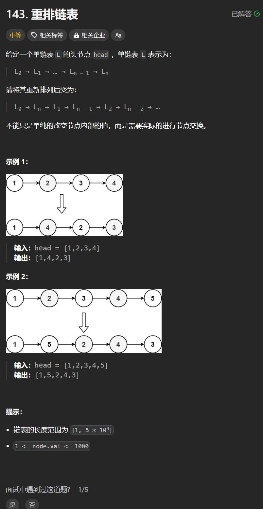

# 143. 重排链表
## 题目链接  
[143. 重排链表](https://leetcode.cn/problems/reorder-list/)
## 题目详情


***
## 解答一
答题者：**Yuiko630**

### 题解
> 用双向队列Deque遍历存放链表节点，如果是偶数取队尾，如果是奇数取队头，重新构造链表。

### 代码
``` Java
/**
 * Definition for singly-linked list.
 * public class ListNode {
 *     int val;
 *     ListNode next;
 *     ListNode() {}
 *     ListNode(int val) { this.val = val; }
 *     ListNode(int val, ListNode next) { this.val = val; this.next = next; }
 * }
 */
class Solution {
    public void reorderList(ListNode head) {
        Deque<ListNode> queue = new LinkedList<>();
        ListNode cur = head.next;
        while(cur != null){
            queue.offer(cur);
            cur = cur.next;
        }
        cur = head;
        int count = 0;
        ListNode node = null;
        while(!queue.isEmpty()){
            if(count % 2 == 0) { // 偶数取后面
                node = queue.pollLast();
            }
            else {
                node = queue.poll();
            }
            cur.next = node;
            cur = node;
            count ++;
        }
        cur.next = null;
    }
}
```