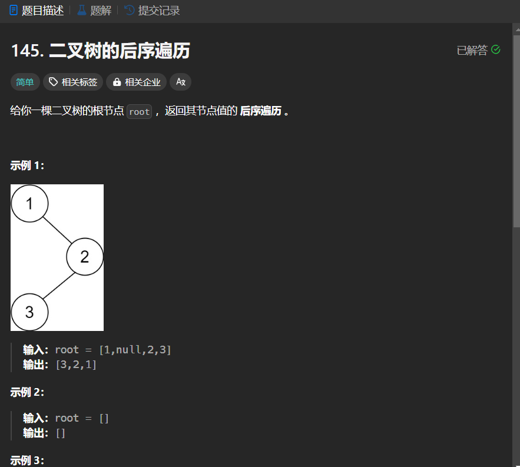

# 145. 二叉树的后序遍历
## 题目链接  
[145. 二叉树的后序遍历](https://leetcode.cn/problems/binary-tree-postorder-traversal/description/)
## 题目详情


***
## 解答一
答题者：EchoBai

### 题解
大家都懂得，用递归就行。

### 代码
``` cpp
/**
 * Definition for a binary tree node.
 * struct TreeNode {
 *     int val;
 *     TreeNode *left;
 *     TreeNode *right;
 *     TreeNode() : val(0), left(nullptr), right(nullptr) {}
 *     TreeNode(int x) : val(x), left(nullptr), right(nullptr) {}
 *     TreeNode(int x, TreeNode *left, TreeNode *right) : val(x), left(left), right(right) {}
 * };
 */
class Solution {
public:
    vector<int> postorderTraversal(TreeNode* root) {
        vector<int> res;
        postorder(root,res);
        return res;
    }
    void postorder(TreeNode* root, vector<int> &res){
        if(!root) return;
        postorder(root->left,res);
        postorder(root->right,res);
        res.push_back(root->val);
    }
};
```

## 解答二
答题者：**Yuiko630**

### 题解
>迭代法，先处理根节点，再把右左非空压栈，得到的序列是中左右，即前序遍历。

### 代码
``` Java
/**
 * Definition for a binary tree node.
 * public class TreeNode {
 *     int val;
 *     TreeNode left;
 *     TreeNode right;
 *     TreeNode() {}
 *     TreeNode(int val) { this.val = val; }
 *     TreeNode(int val, TreeNode left, TreeNode right) {
 *         this.val = val;
 *         this.left = left;
 *         this.right = right;
 *     }
 * }
 */
class Solution {
    public List<Integer> preorderTraversal(TreeNode root) {
        List<Integer> results = new ArrayList<Integer>();
        Stack<TreeNode> stack = new Stack<TreeNode>();
        if(root == null) return results;
        stack.push(root);
        while(!stack.isEmpty()){
            TreeNode tmp = stack.pop();
            results.add(tmp.val);
            if(tmp.right != null) stack.push(tmp.right);
            if(tmp.left != null) stack.push(tmp.left);
        }
        return results;
    }
}
```
