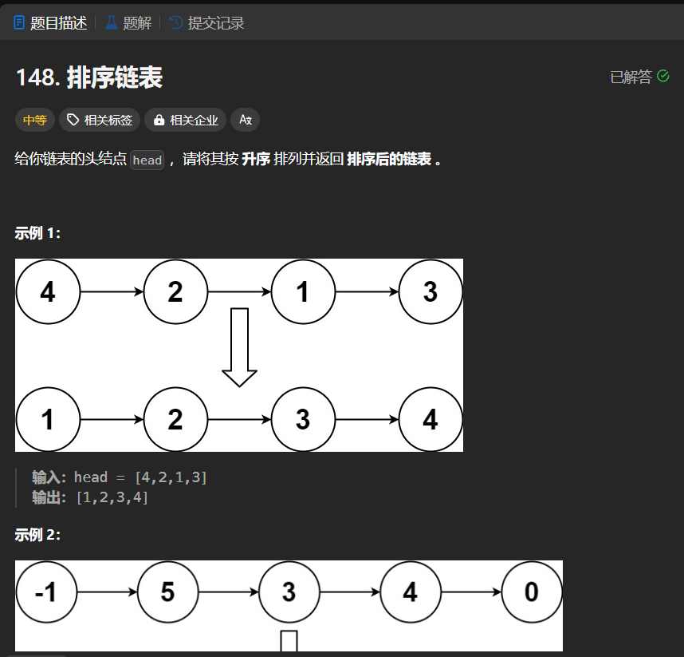

# 148. 排序链表
## 题目链接  
[148. 排序链表](https://leetcode.cn/problems/sort-list/description/)
## 题目详情


***
## 解答一
答题者：EchoBai

### 题解
使用一个`vector`将`<ListNode*, val>`组成一个`pair`放入，然后排序，最后在重新组合链表即可。需要注意的是在重组的过程中需要将链表原来的链接信息清除。

### 代码
``` cpp
/**
 * Definition for singly-linked list.
 * struct ListNode {
 *     int val;
 *     ListNode *next;
 *     ListNode() : val(0), next(nullptr) {}
 *     ListNode(int x) : val(x), next(nullptr) {}
 *     ListNode(int x, ListNode *next) : val(x), next(next) {}
 * };
 */
class Solution {
public:
    ListNode* sortList(ListNode* head) {
        if(!head || !head->next) return head;
        ListNode* res = new ListNode(-1);
        ListNode* p = head;
        head = res;
        vector<pair<ListNode*, int>>v;
        while(p){
            v.push_back(make_pair(p,p->val));
            p = p->next;
        }
        sort(v.begin(),v.end(),cmp);
        for(auto e : v){
            e.first->next = nullptr;
            res->next = e.first;
            res = res->next;
        }
        return head->next;
    }
    static bool cmp(const pair<ListNode*,int> &p1,const pair<ListNode*,int> &p2)
    {
        return p1.second < p2.second;
    }
};
```


