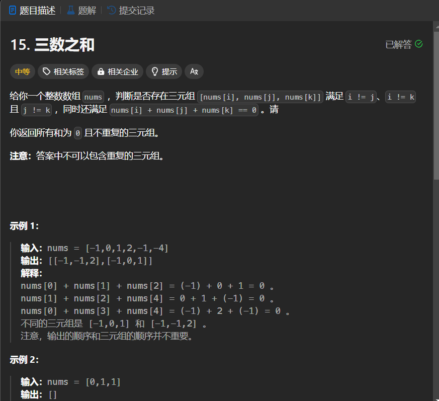

# 15. 三数之和
## 题目链接  
[15. 三数之和](https://leetcode.cn/problems/3sum/description/)
## 题目详情


***
## 解答一
答题者：EchoBai

### 题解
先对数组排序，若首项大于0或者数组长度小于3，那么无解直接返回空。再来看排序之后的结果，我们可以用一个左指针指向当前位置的下一个位置，用一个右指针指向数组的末尾，两个指针分别移动即可。另外需检查结果是否存在相同的，可以检查指针的下一位是否和其相同从而跳过。该方法可避免暴力枚举带来的超时，将时间复杂度进一步缩短。

### 代码
``` cpp
class Solution {
public:
    vector<vector<int>> threeSum(vector<int>& nums) {
        vector<vector<int>> res;
        int size = nums.size();
        sort(nums.begin(),nums.end());
        if(nums[0] > 0 || size < 3)
            return res;
        
        for(int i = 0; i < size; ++i){
            int left = i + 1;
            int right = size - 1;
            if(i > 0 && nums[i] == nums[i - 1]){
                continue;
            }
            while(left < right) {
                if(nums[i] + nums[left] + nums[right] == 0){
                    res.push_back({nums[i],nums[left],nums[right]});
                    ++left;
                    --right;
                    while(left < right && nums[left] == nums[left - 1]){
                        ++left;
                    }
                    while(left < right && nums[right] == nums[right + 1]){
                        --right;
                    }
                }else if(nums[i] + nums[left] + nums[right] > 0){
                    --right;
                }else{
                    ++left;
                }
            }
        }
        return res;
    }
};
```

```c++
class Solution {
public:
    vector<vector<int>> threeSum(vector<int>& nums) {
        vector<vector<int>> res;

        for(int i = 0; i < nums.size(); ++i){
            for(int j = i + 1; j < nums.size(); ++j){
                for(int k = j + 1; k < nums.size(); ++k){
                    vector<int> ve;
                    if((nums[i] + nums[j] + nums[k]) == 0){
                        ve.push_back({nums[i],nums[j],nums[k]});
                        sort(ve.begin(),ve.end());
                        if(find(res.begin(),res.end(),ve) == res.end())
                            res.push_back(ve);
                    }
                }
            }
        }
        return res;
    }
};
```


