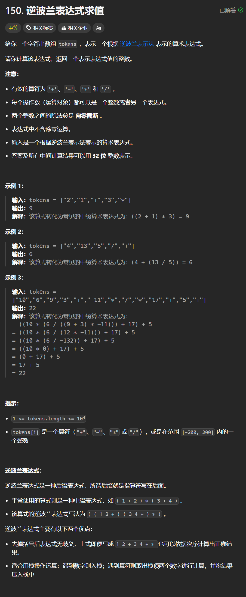

# 150. 逆波兰表达式
## 题目链接  
[150. 逆波兰表达式](https://leetcode.cn/problems/evaluate-reverse-polish-notation/description/)
## 题目详情


***
## 解答一
答题者：**Yuiko630**

### 题解
>遇到数字则入栈，遇到运算符则取栈顶2个数字进行计算，并将结果压栈。

### 代码
``` Java
class Solution {
    public int evalRPN(String[] tokens) {
        Stack<Integer> stack = new Stack<>();
        for(int i = 0; i < tokens.length; i++){
            if(!("+".equals(tokens[i]) || "-".equals(tokens[i]) || "*".equals(tokens[i]) || "/".equals(tokens[i]))){
                stack.push(Integer.valueOf(tokens[i]));
            }
            else{
                int a = stack.pop();
                int b = stack.pop();
                switch(tokens[i]){
                    case "+": stack.push(a+b);break;
                    case "-": stack.push(b-a);break;
                    case "*": stack.push(a*b);break;
                    case "/": stack.push(b/a);break;
                }
            }
        }
        return stack.peek();
    }
}
```