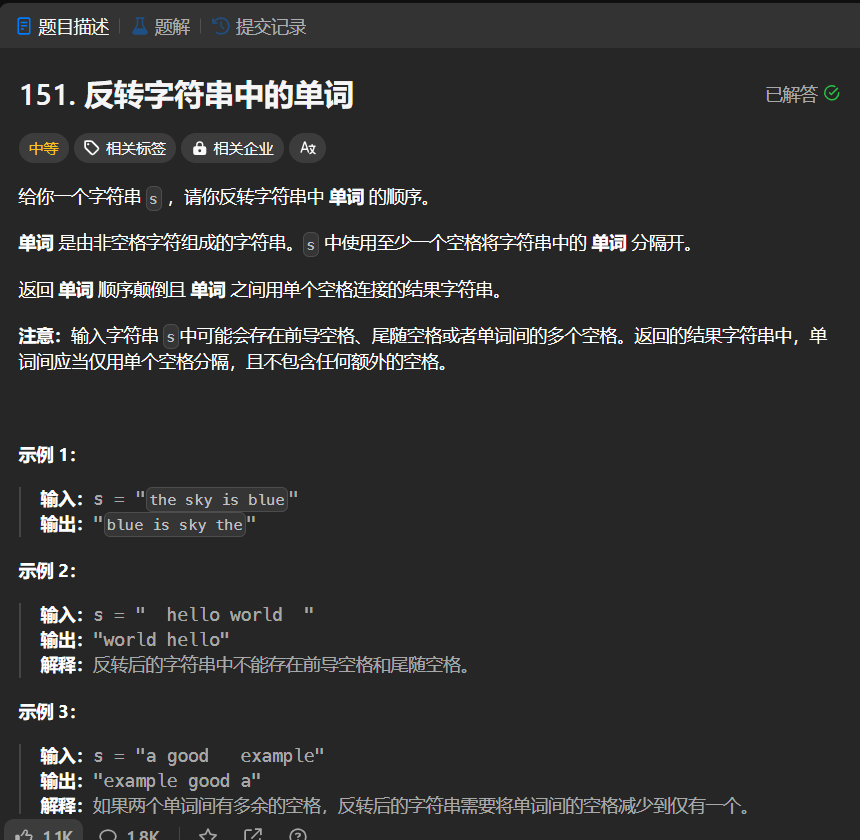

# 151. 反转字符串中的单词
## 题目链接  
[151. 反转字符串中的单词](https://leetcode.cn/problems/reverse-words-in-a-string/description/?envType=study-plan-v2&envId=top-interview-150)
## 题目详情


***
## 解答一
答题者：EchoBai

### 题解
将字符串中每一个单词添加到栈中，然后出栈即可。

### 代码
``` cpp
class Solution {
public:
    string reverseWords(string s) {
        int len = s.size();
        string res;
        if(len == 0) return res;
        stack<string> words;
        int i = 0;
        while(i < len){
            string w;
            while(s[i] == ' ' && i < len)i++;
            while(s[i] != ' ' && i < len){
                w.push_back(s[i]);
                i++;
            }
            w.push_back(' ');
            words.push(w);
        }
        while(!words.empty()){
            res += words.top();
            words.pop();
        }
        while(res.size() > 1 && res[0] == ' ')res.erase(res.begin());
        res.pop_back();
        return res;
    }
};
```


