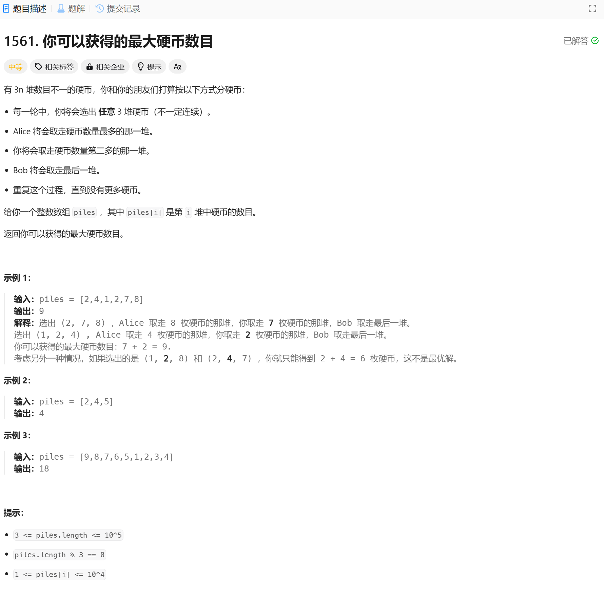

# 1561. 你可以获得的最大硬币数目
## 题目链接  
[1561. 你可以获得的最大硬币数目](https://leetcode.cn/problems/maximum-number-of-coins-you-can-get/description/?envType=daily-question&envId=2025-01-22)
## 题目详情


***
## 解答一
答题者：EchoBai

### 题解
先按递减排序，然后前两个数从后面选，另一个数从末尾选，这样能保证第二个数取到的是相对大的，最后取和即可。

### 代码
``` cpp
class Solution {
public:
    int maxCoins(vector<int>& piles) {
        int res = 0;
        sort(piles.begin(), piles.end(), [&](const int& a, const int& b){
            return a > b;
        });
        int size = piles.size();
        int i = 0, j = size - 1;
        while(i < j){
            res += piles[i+1];
            i += 2;
            --j;
        }
        return res;
    }
};
```
