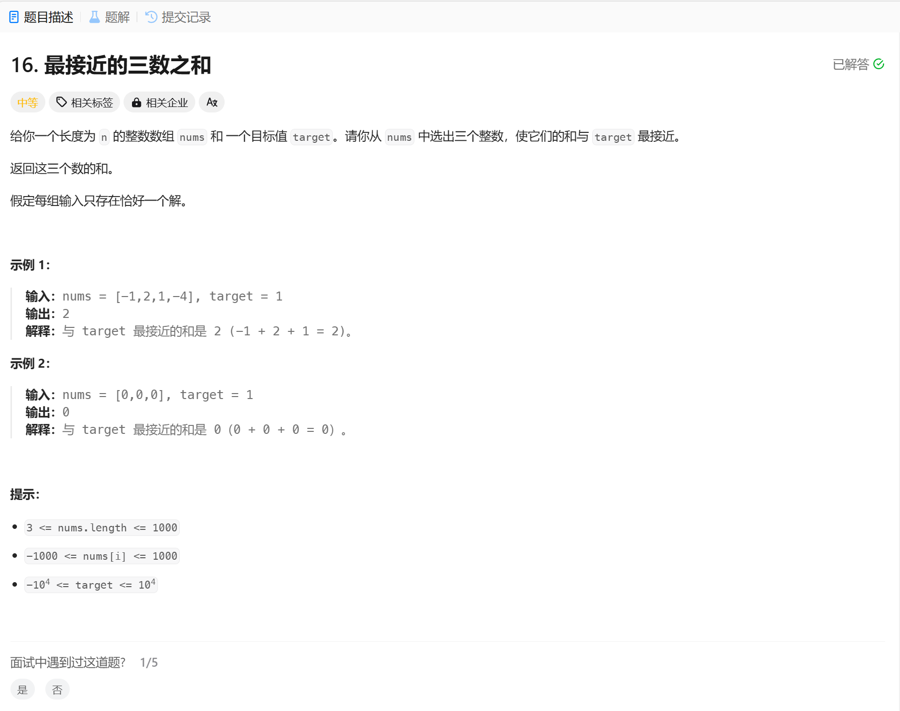

# 16. 最接近的三数之和
## 题目链接  
[16. 最接近的三数之和](https://leetcode.cn/problems/3sum-closest/)
## 题目详情


***
## 解答一
答题者：EchoBai

### 题解
排序 + 双指针。同三数之和，只需要每次记录最接近的和就行。另这题题目给的数组长度其实并不是很大，直接暴力搜索也能AC。代码一同附上。

### 代码
``` cpp
class Solution {
public:
    int threeSumClosest(vector<int>& nums, int target) {
        int distance = INT_MAX;
        int res = 0;
        int size = nums.size();
        int sum = 0;
        sort(nums.begin(), nums.end());
        for(int i = 0; i < size; ++i){
            if(i > 0 && nums[i - 1] == nums[i]) continue;
            int left = i + 1;
            int right = size - 1;
            while(left < right){
                sum = nums[i] + nums[left] + nums[right];
                int rd = (sum > target) ? (sum - target) : (target - sum);
                
                if( rd < distance){
                    distance = rd;
                    res = sum;
                }
                if(sum == target){
                    break;
                }else if(sum > target){
                    --right;
                }else if(sum < target){
                    ++left;
                }
            }
        }

        return res;
    }
};
```

```c++
class Solution {
public:
    int threeSumClosest(vector<int>& nums, int target) {
        int distance = INT_MAX;
        int res = 0;
        int size = nums.size();
        int sum = 0;
        for(int i = 0; i < size; ++i){
            for(int j = i + 1; j < size; ++j){
                for(int k = j + 1; k < size; ++k){
                    sum = nums[i] + nums[j] + nums[k];
                    int rd = (sum > target) ? (sum - target) : (target - sum);
                    
                    if( rd < distance){
                        distance = rd;
                        res = sum;
                    }
                }
            }
        }
        return res;
    }
};
```


