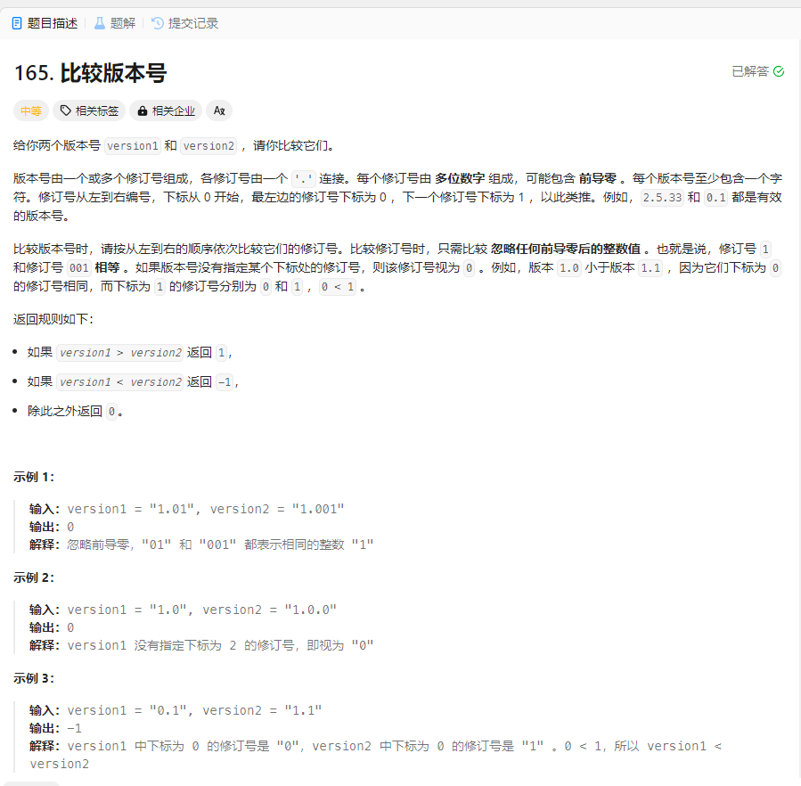

# 165. 比较版本号
## 题目链接  
[165. 比较版本号](https://leetcode.cn/problems/compare-version-numbers/description/)
## 题目详情


***
## 解答一
答题者：EchoBai

### 题解
首先根据分隔符将字符串划分为不同的字符串数组，然后对于每一个字符串如果其含有多个前导0，那么去掉多余的只需保留一个即可。最后针对字符串数组将每一个字符串转化为`int`类型进行比较，依次返回结果。需要注意的是，两个版本号的字符串可能是不同的长度，因此我们还需要判断较长版本号是否存在不为0的字符串，进而决定两个版本号的大小。

### 代码
``` cpp
class Solution {
public:
    int compareVersion(string version1, string version2) {
        int res = 0;
        vector<string> v1 = split(version1, ".");
        vector<string> v2 = split(version2, ".");
        for(int i = 0; i < v1.size(); ++i){
            string t = handleStr(v1[i]);
            v1[i] = t;
        }
        for(int i = 0; i < v2.size(); ++i){
            string t = handleStr(v2[i]);
            v2[i] = t;
        }
        int minLen = min(v1.size(),v2.size());
        int i = 0;
        for(i = 0; i < minLen; ++i){
            int i1 = atoi(v1[i].c_str());
            int i2 = atoi(v2[i].c_str());
            if(i1 > i2) return 1;
            else if(i1 < i2) return -1;
        }
        if(v1.size() > i){
            for(int j = i; j < v1.size(); ++j){
                string s = v1[j];
                if(s[0] != '0')
                    return 1;
            }
        }
        else if(v2.size() > i){
            for(int j = i; j < v2.size(); ++j){
                string s = v2[j];
                if(s[0] != '0')
                    return -1;
            }
        }
        return res;

    }
    string handleStr(string s){
       while(s.size() > 1 && s[0] == '0') s.erase(s.begin());
       return s;
    }
    vector<string> split(const string& str, const string& delim) {
        vector<string> res;
        if("" == str) return res;
        //先将要切割的字符串从string类型转换为char*类型
        char * strs = new char[str.length() + 1] ; //不要忘了
        strcpy(strs, str.c_str()); 

        char * d = new char[delim.length() + 1];
        strcpy(d, delim.c_str());

        char *p = strtok(strs, d);
        while(p) {
            string s = p; //分割得到的字符串转换为string类型
            res.push_back(s); //存入结果数组
            p = strtok(NULL, d);
        }

        return res;
    }
};
```


