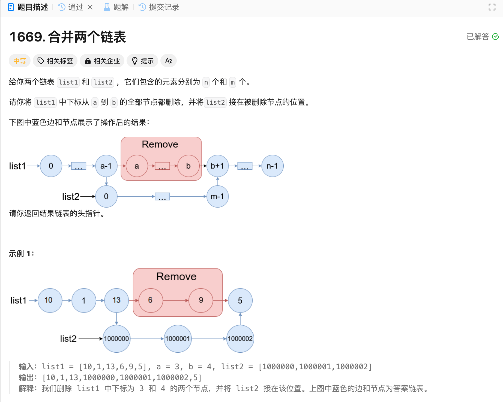

# 1669. 合并两个链表
## 题目链接  
[1669. 合并两个链表](https://leetcode.cn/problems/merge-in-between-linked-lists/description/)
## 题目详情


***
## 解答一
答题者：EchoBai

### 题解
找到待删除节点序列的前一个和后一个节点，然后改变链接关系即可。

### 代码
``` cpp
/**
 * Definition for singly-linked list.
 * struct ListNode {
 *     int val;
 *     ListNode *next;
 *     ListNode() : val(0), next(nullptr) {}
 *     ListNode(int x) : val(x), next(nullptr) {}
 *     ListNode(int x, ListNode *next) : val(x), next(next) {}
 * };
 */
class Solution {
public:
    ListNode* mergeInBetween(ListNode* list1, int a, int b, ListNode* list2) {
        ListNode* pre;
        ListNode* last;
        ListNode* res = list1;
        int idx = 0;
        while(list1){
            if(idx == (a - 1)){
                pre = list1;
            }else if(idx == (b + 1)){
                last = list1;
            }
            ++idx;
            list1 = list1->next;
        }
        pre->next = list2;
        ListNode* p = list2;
        while(p->next){
            p = p->next;
        }
        p->next = last;
        return res;

    }
};
```
