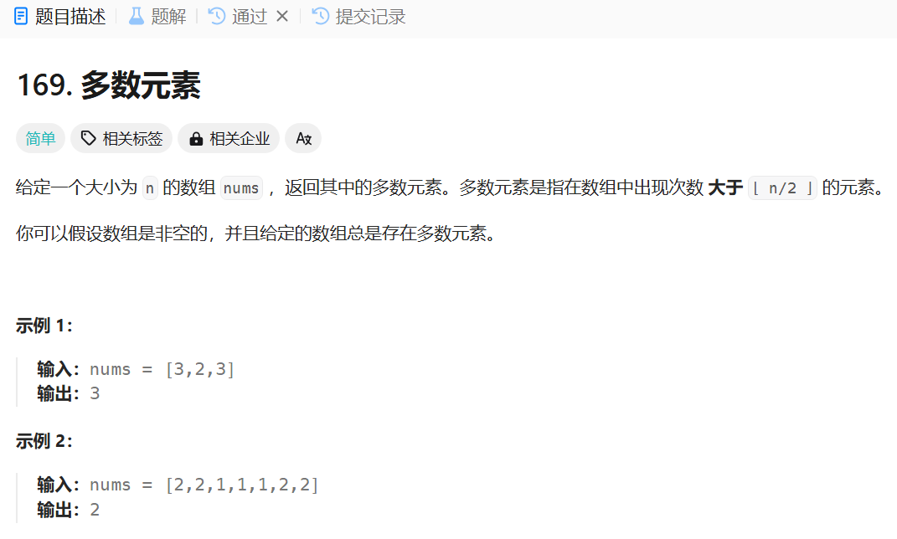

# 169. 多数元素
## 题目链接  
[169. 多数元素](https://leetcode.cn/problems/majority-element/description/)
## 题目详情


***
## 解答一
答题者：**Yuiko630**

### 题解
>创建一个字典Map充当哈希表，键是数组中的数，值是这个数出现的次数，遍历数组后建好字典，最后返回字典中最大的值对应的键。

### 代码
``` Java
class Solution {
    public int majorityElement(int[] nums) {
        Map<Integer, Integer> count = new HashMap<Integer, Integer>();
        for(int i = 0; i < nums.length; i++){
            if(!count.containsKey(nums[i])){
                count.put(nums[i], 1);
            }
            else{
                count.put(nums[i], count.get(nums[i])+1);
            }
        }
        int max = 0;
        int max_value = 0;
        for(int i = 0; i < nums.length; i++){
            if(count.get(nums[i]) > max){
                max = count.get(nums[i]);
                max_value = nums[i];
            }
        }
        return max_value;
    }
}
```

***
## 解答二
答题者：**Yuiko630学的LeetCode题解**

### 题解
>因为题目说了多数元素是指在数组中出现次数 大于⌊ n/2 ⌋的元素。故只要将数组从小到大排序，多数元素一定是位于[n/2]的位置。

### 代码
``` Java
class Solution {
    public int majorityElement(int[] nums) {
        Arrays.sort(nums);
        return nums[nums.length / 2];
    }
}
```