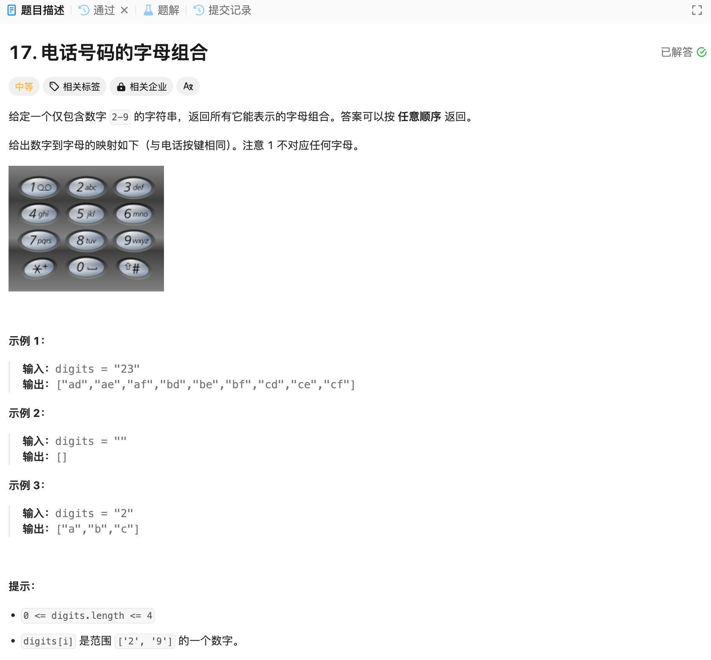

# 17. 电话号码的字母组合
## 题目链接  
[17. 电话号码的字母组合](https://leetcode.cn/problems/letter-combinations-of-a-phone-number/description/)
## 题目详情


***
## 解答一
答题者：EchoBai

### 题解
递归 + 回溯，终止条件就是生成的子串长度和数字长度一样。另外定义一个map存储每个数字对应的字母，根据字母取出对应的字符串，然后遍历字符串取出所有可能的组合。

### 代码
``` cpp
class Solution {
    vector<string> res;
    string str;
    std::map<char, std::string> mp;
public:
    vector<string> letterCombinations(string digits) {
        int len = digits.length();
        
        mp['2'] = "abc";
        mp['3'] = "def";
        mp['4'] = "ghi";
        mp['5'] = "jkl";
        mp['6'] = "mno";
        mp['7'] = "pqrs";
        mp['8'] = "tuv";
        mp['9'] = "wxyz";

        if(len == 0) return res;

        backtracking(len, digits, 0, mp);
        return res;
    }

    void backtracking(int len,string digits, int startIdx, std::map<char, std::string> mp){
        if(str.length() == len){
            res.push_back(str);
            return;
        }

        std::string s = mp[digits[startIdx]];
        for(int j = 0; j < s.length(); ++j){
            str.push_back(s[j]);
            backtracking(len, digits, startIdx + 1, mp);
            str.pop_back();
        }
        
    }
};
```


