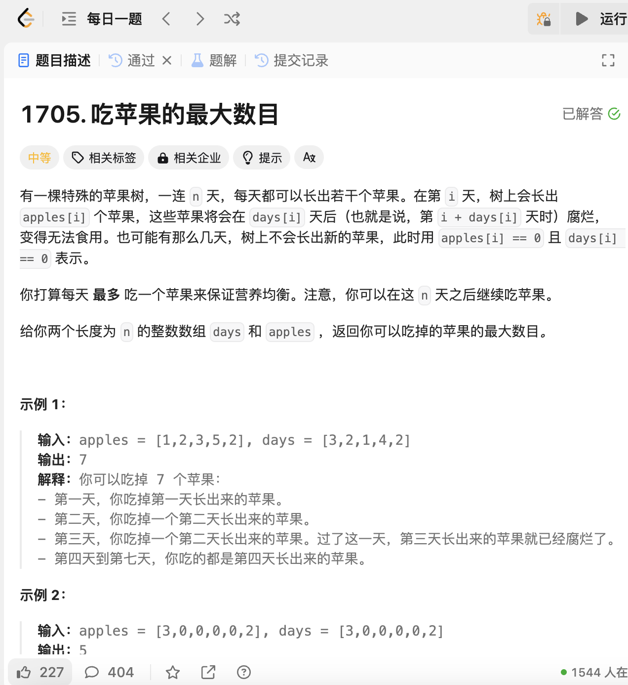

# 1705. 吃苹果的最大数目
## 题目链接  
[1705. 吃苹果的最大数目](https://leetcode.cn/problems/maximum-number-of-eaten-apples/description/?envType=daily-question&envId=2024-12-24)
## 题目详情


***
## 解答一
答题者：EchoBai

### 题解
用一个小顶堆，存储 (过期时间, 剩余苹果数量)，然后每天检查过期时间是否小于当前天数，小于就及时移除，因为已经过期了，当队列不为空的时候就检查，取出堆顶元素，这是最接近过期的苹果，吃掉一个，然后数量减1，如果剩余数量大于1，则放回，否则已经吃完了，就不放回了。最后得到的就是能吃掉的最大的苹果数量。

### 代码
``` cpp
class Solution {
public:
    int eatenApples(vector<int>& apples, vector<int>& days) {
        int n = apples.size();
        int result = 0;

        // 小顶堆，存储 (过期时间, 剩余苹果数量)
        priority_queue<pair<int, int>, vector<pair<int, int>>, greater<>> pq;

        for(int i = 0; i < n || !pq.empty(); ++i){
            while(!pq.empty() && pq.top().first <= i){
                pq.pop();
            }

            if(i < n && apples[i] > 0){
                pq.emplace(i + days[i], apples[i]);
            }

            if(!pq.empty()){
                auto [expir, cnt] = pq.top();
                pq.pop();
                ++result;
                if(cnt > 1){
                    pq.emplace(expir, cnt - 1);
                }
            }
        }
        return result;
    }
};
```
