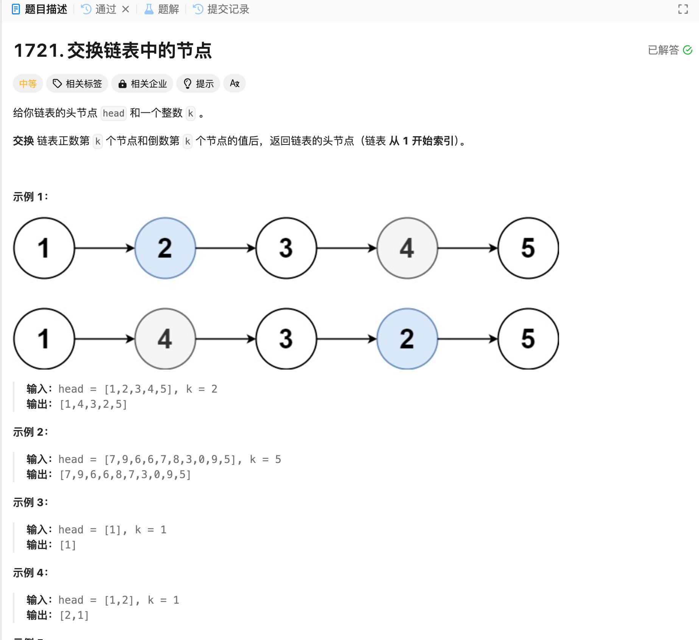

# 1721. 交换链表中的节点
## 题目链接  
[1721. 交换链表中的节点](https://leetcode.cn/problems/swapping-nodes-in-a-linked-list/description/)
## 题目详情


***
## 解答一
答题者：EchoBai

### 题解
遍历找到对应节点即可。

### 代码
``` cpp
/**
 * Definition for singly-linked list.
 * struct ListNode {
 *     int val;
 *     ListNode *next;
 *     ListNode() : val(0), next(nullptr) {}
 *     ListNode(int x) : val(x), next(nullptr) {}
 *     ListNode(int x, ListNode *next) : val(x), next(next) {}
 * };
 */
class Solution {
public:
    ListNode* swapNodes(ListNode* head, int k) {
        // one head
        if(!head->next) return head; 
        ListNode* pre;
        ListNode* last;
        ListNode* res = head;
        ListNode* p = head;
        ListNode* tmp = head;
        int len = 0;
        
        while(p){
            ++len;
            if(len == k){
                pre = p;
            }
            p = p->next;
        }
        int idx = 1;
        while(tmp){
            if (idx == (len - k + 1)){
                last = tmp;
            }
            ++idx;
            tmp = tmp->next;
        }

        int val = pre->val;
        pre->val = last->val;
        last->val = val;
        return res;
    }
};
```
