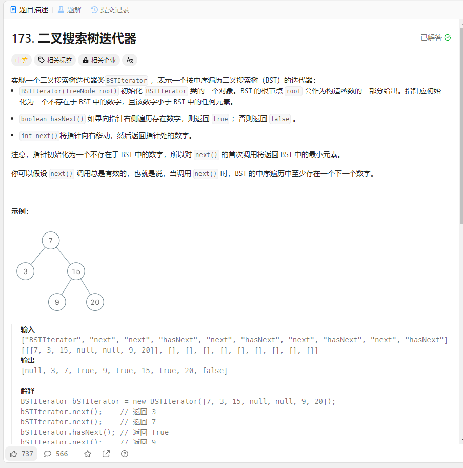

# 173. 二叉搜索树迭代器
## 题目链接  
[173. 二叉搜索树迭代器](https://leetcode.cn/problems/binary-search-tree-iterator/description/?envType=study-plan-v2&envId=top-interview-150)
## 题目详情


## 解答一
答题者：EchoBai

### 题解
直接构造一个层序遍历的结果和一个指针。

### 代码
``` cpp
/**
 * Definition for a binary tree node.
 * struct TreeNode {
 *     int val;
 *     TreeNode *left;
 *     TreeNode *right;
 *     TreeNode() : val(0), left(nullptr), right(nullptr) {}
 *     TreeNode(int x) : val(x), left(nullptr), right(nullptr) {}
 *     TreeNode(int x, TreeNode *left, TreeNode *right) : val(x), left(left), right(right) {}
 * };
 */
class BSTIterator {
private:
    vector<int> inorder(TreeNode* root){
        vector<int> res;
        travel(root,res);
        return res;
    }
    void travel(TreeNode* root, vector<int> &res){
        if(!root) return;
        travel(root->left,res);
        res.push_back(root->val);
        travel(root->right,res);
    }

    vector<int> res;
    int point;
public:
    BSTIterator(TreeNode* root){
        this->point = 0;
        this->res = inorder(root);
    }
    
    int next() {
        return this->res[point++];
    }
    
    bool hasNext() {
        return (this->point < this->res.size());
    }
};

/**
 * Your BSTIterator object will be instantiated and called as such:
 * BSTIterator* obj = new BSTIterator(root);
 * int param_1 = obj->next();
 * bool param_2 = obj->hasNext();
 */
```


