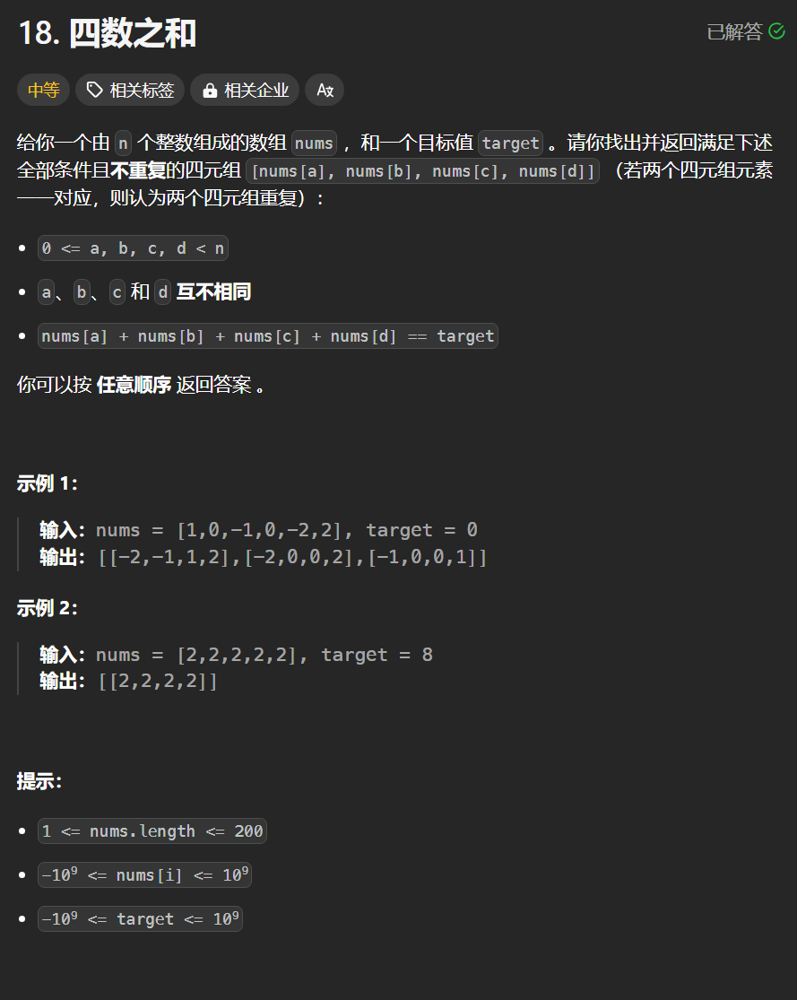

# 18. 四数之和
## 题目链接  
[18. 四数之和](https://leetcode.cn/problems/4sum/description/)
## 题目详情


***
## 解答一
答题者：**Yuiko630**

### 题解
>先排序后用双指针，两重循环ij。

>i跳过重复的，且比target大的非负数直接break，j跳过重复的，且与i和比target大的非负数直接break。

>双指针left和right分别指向j+1和n-1，根据与target大小比较相应移动，注意，找到解后去重left和right都要移到下一个不同的数上。

>注意四数相加可能溢出，(long)类型转换。

### 代码
``` Java
class Solution {
    public List<List<Integer>> fourSum(int[] nums, int target) {
        Arrays.sort(nums);
        int n = nums.length;
        int left = 1;
        int right = n - 1;
        List<List<Integer>> result = new ArrayList<List<Integer>>();
        for (int i = 0; i < right; i++) {
            if (nums[i] > target && nums[i] >= 0) break;
            if (i > 0 && nums[i] == nums[i - 1]) {
                continue;
            }
            for(int j = i+1; j < right; j++){
                if(nums[i] + nums[j] > target && nums[i] + nums[j] >= 0) break;
                if (j > i + 1 && nums[j] == nums[j - 1]) {
                    continue;
                }
                left = j + 1;
                right = n - 1;
                while (left < right) {
                    if ((long)nums[i] + nums[j] + nums[left] + nums[right] > target) {
                        right--;
                    } 
                    else if ((long)nums[i] + nums[j] + nums[left] + nums[right] < target) {
                        left++;
                    } 
                    else {
                        // if(nums[right] == nums[right-1] && nums[left] == nums[left-1]) break;
                        List<Integer> res = new ArrayList<>();
                        res.add(nums[i]);
                        res.add(nums[j]);
                        res.add(nums[left]);
                        res.add(nums[right]);
                        result.add(res);
                        while (left < right && nums[right] == nums[right - 1])
                            right--;
                        while (left < right && nums[left] == nums[left + 1])
                            left++;
                        left++;
                        right--;
                    }
                }
            }
            
        }
        return result;
    }
}
```