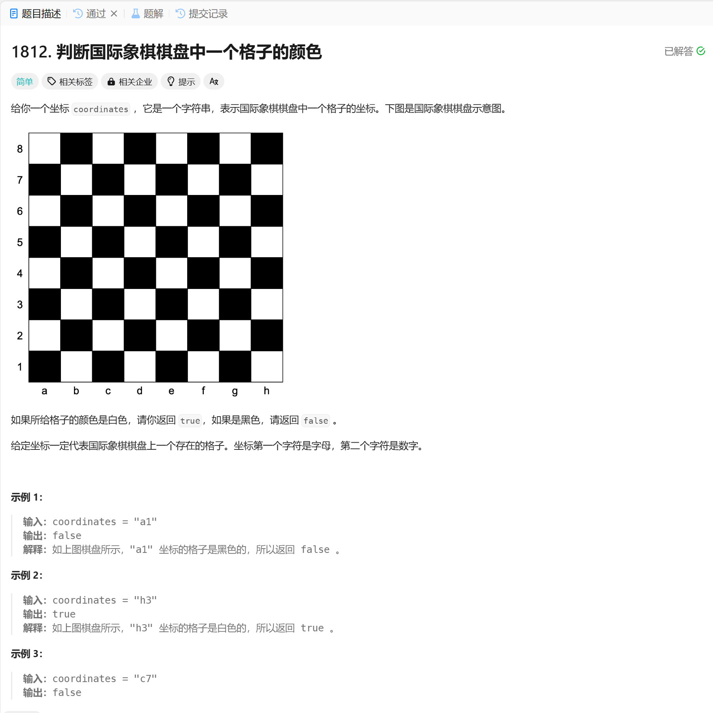

# 1812. 判断国际象棋棋盘中一个格子的颜色
## 题目链接  
[1812. 判断国际象棋棋盘中一个格子的颜色](https://leetcode.cn/problems/determine-color-of-a-chessboard-square/description/?envType=daily-question&envId=2024-12-09)
## 题目详情


***
## 解答一
答题者：EchoBai

### 题解
将行列转化为数字坐标，分析就可以发现，坐标全是奇数或者全是偶数都是黑色，一奇数一偶数则全是白色。

### 代码
``` cpp
class Solution {
public:
    bool squareIsWhite(string coordinates) {
        int col = coordinates[0] - 'a' + 1;
        int row = coordinates[1] - '0';
        
        //white (odd,even) or (even,odd)
        if((col % 2 == 1 && row % 2 == 0) || (col % 2 == 0 && row % 2 == 1)){
            return true;
        }
        return false;
    }
};
```
