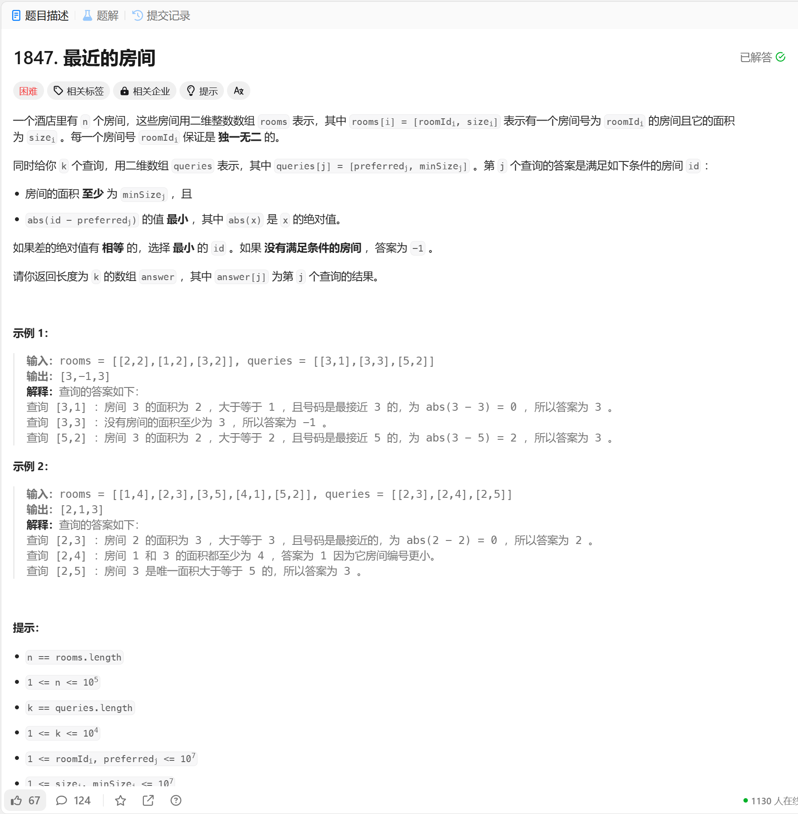

# 1847. 最近的房间
## 题目链接  
[1847. 最近的房间](https://leetcode.cn/problems/closest-room/description/?envType=daily-question&envId=2024-12-16)
## 题目详情


***
## 解答一
答题者：EchoBai

### 题解
先对rooms从大到小排序，在将queries从大到小排序，排序下标即可，然后依次遍历排序好的，将大于当前下标对应房间尺寸的房间Id都放入一个set中，然后从set中找第一个大于它的房间号，此时检查左右两边看看谁更小然后放入结果集就行。

### 代码
``` cpp
class Solution {
public:
    vector<int> closestRoom(vector<vector<int>>& rooms, vector<vector<int>>& queries) {
        int qsize = queries.size();
        vector<int> res(qsize, -1);
        sort(rooms.begin(), rooms.end(), [](const std::vector<int>& a, const std::vector<int>& b) {
            return a[1] > b[1]; 
        });

        vector<int> queryIds(qsize);
        iota(queryIds.begin(),queryIds.end(), 0);

        sort(queryIds.begin(), queryIds.end(), [&queries](const int id1, const int id2) {
            return queries[id1][1] > queries[id2][1]; 
        });

        set<int> roomIds;
        int i = 0;

        for(int id : queryIds){
            int preferredId, minSize;
            preferredId = queries[id][0];
            minSize =  queries[id][1];
            while(i < rooms.size() && rooms[i][1] >= minSize){
                roomIds.insert(rooms[i][0]);
                i++;
            }

            int distance = INT_MAX;
            // find the first element not less than preferredId
            auto it = roomIds.lower_bound(preferredId);
            if(it != roomIds.begin()){
                auto pre = prev(it);
                distance = preferredId - *pre;
                res[id] = *pre;
            }

            if(it != roomIds.end() && *it - preferredId < distance){
                res[id] = *it;
            }
        }
        
        return res;

    }
};
```
