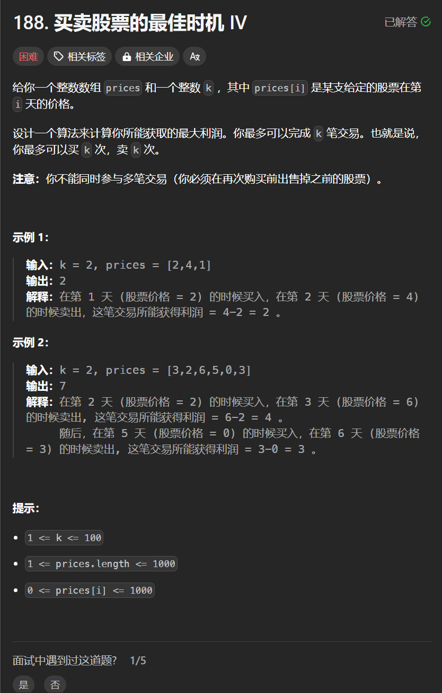

# 188. 买股票的最佳时机 IV
## 题目链接  
[链接](https://leetcode.cn/problems/best-time-to-buy-and-sell-stock-iv/)
## 题目详情


***
## 解答一
答题者：**Yuiko630**

### 题解
>定义:dp[i][2*k+1]，dp[i][0]无操作，dp[i][2*k+1]表示第i天第k次持有股票最多现金，dp[i][2*k+2]表示第i天第k次不持有股票最多现金
>2. 转移方程:
> > 第k次持有：dp[i][j] = Math.max(dp[i-1][j], dp[i-1][j-1] - prices[i]); 昨天持有或者今天买入
> > 第k次不持有：dp[i][j+1] = Math.max(dp[i-1][j+1], dp[i-1][j] + prices[i]); 昨天不持有或者昨天持有今天卖出
>3. 初始化:dp[0][奇数] = -prices[0];
>4. 遍历:正序遍历prices即可
>5. 推导

### 代码
``` java
class Solution {
    public int maxProfit(int k, int[] prices) {
        int length = prices.length;
        int[][] dp = new int[length][2*k + 1];
        // 初始化
        for(int i = 1; i < 2*k+1; i += 2){
            dp[0][i] = -prices[0];
        }
        for(int i = 1; i < length; i++){
            //第k次持有和不持有
            for(int j = 1; j < 2*k; j += 2){
                dp[i][j] = Math.max(dp[i-1][j], dp[i-1][j-1] - prices[i]);
                dp[i][j+1] = Math.max(dp[i-1][j+1], dp[i-1][j] + prices[i]);
            }
        }
        return dp[length-1][2*k];
    }
}
```