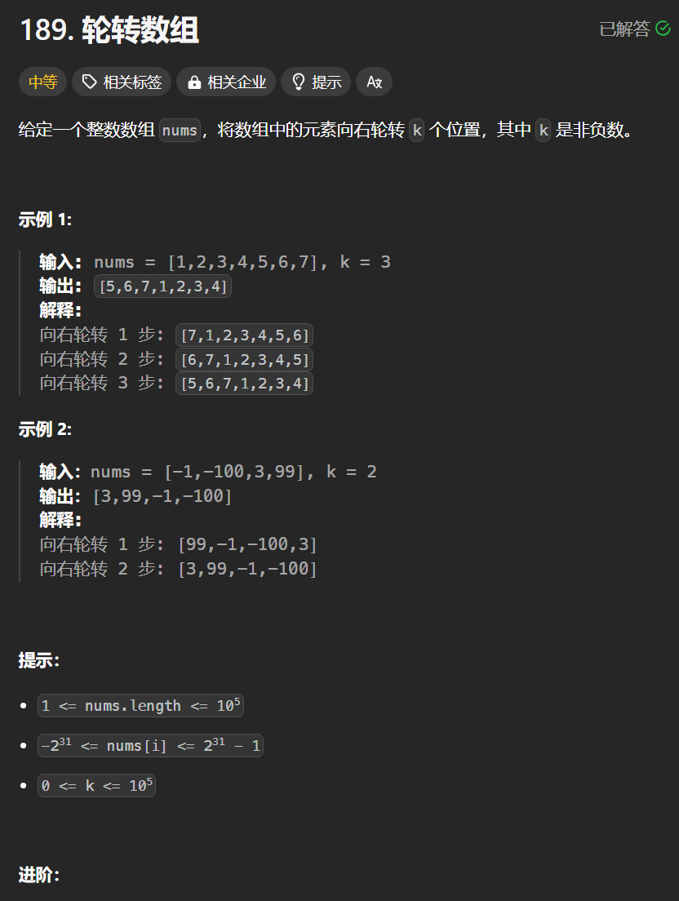

# 189. 轮转数组
## 题目链接  
[189. 轮转数组](https://leetcode.cn/problems/rotate-array/)
## 题目详情


***
## 解答一
答题者：**Yuiko630**

### 题解
>右旋数组，即反转整个数组，再反转前k，再反转后面n-k。注意k%=n；

### 代码
``` java
class Solution {
    public void reverse(int[] nums, int start, int end){
        for(int i = start, j = end; i < j; i++, j--){
            int temp = nums[i];
            nums[i] = nums[j];
            nums[j] = temp;
        }
    }
    public void rotate(int[] nums, int k) {
        int n = nums.length;
        k %= n;
        reverse(nums, 0, n-1);
        reverse(nums, 0, k-1);
        reverse(nums, k , n-1);
    }
}
```