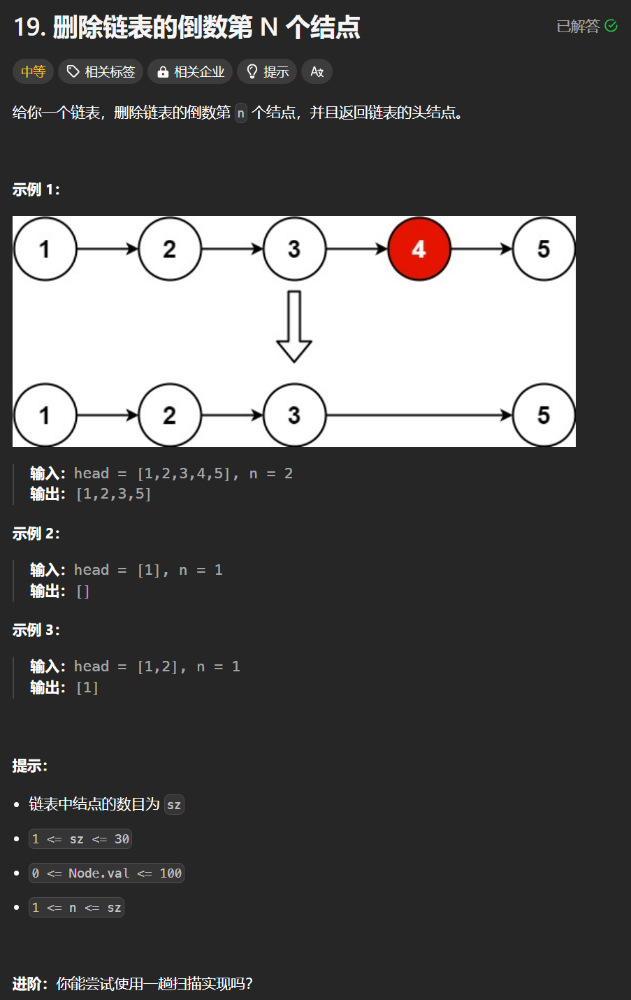

# 19. 删除链表的倒数第N个节点
## 题目链接  
[19. 删除链表的倒数第N个节点](https://leetcode.cn/problems/remove-nth-node-from-end-of-list/description/)
## 题目详情


## 解答一
答题者：**Yuiko630**

### 题解
>删除结点的操作最好新建个虚拟头节点，不用对头单独判断，双指针，fast比slow先走n步，最后删除slow.next

### 代码
``` Java
/**
 * Definition for singly-linked list.
 * public class ListNode {
 *     int val;
 *     ListNode next;
 *     ListNode() {}
 *     ListNode(int val) { this.val = val; }
 *     ListNode(int val, ListNode next) { this.val = val; this.next = next; }
 * }
 */
class Solution {
    public ListNode removeNthFromEnd(ListNode head, int n) {
        ListNode dummyNode = new ListNode(0, head);
        ListNode fast = dummyNode;
        for(int i = 0;i < n; i++){
            fast = fast.next;
        }
        ListNode slow = dummyNode;
        while(fast.next != null){
            fast = fast.next;
            slow = slow.next;
        }
        if(slow.next != null)
            slow.next = slow.next.next;
        else
            slow.next = null;
        return dummyNode.next;
    }
}
```