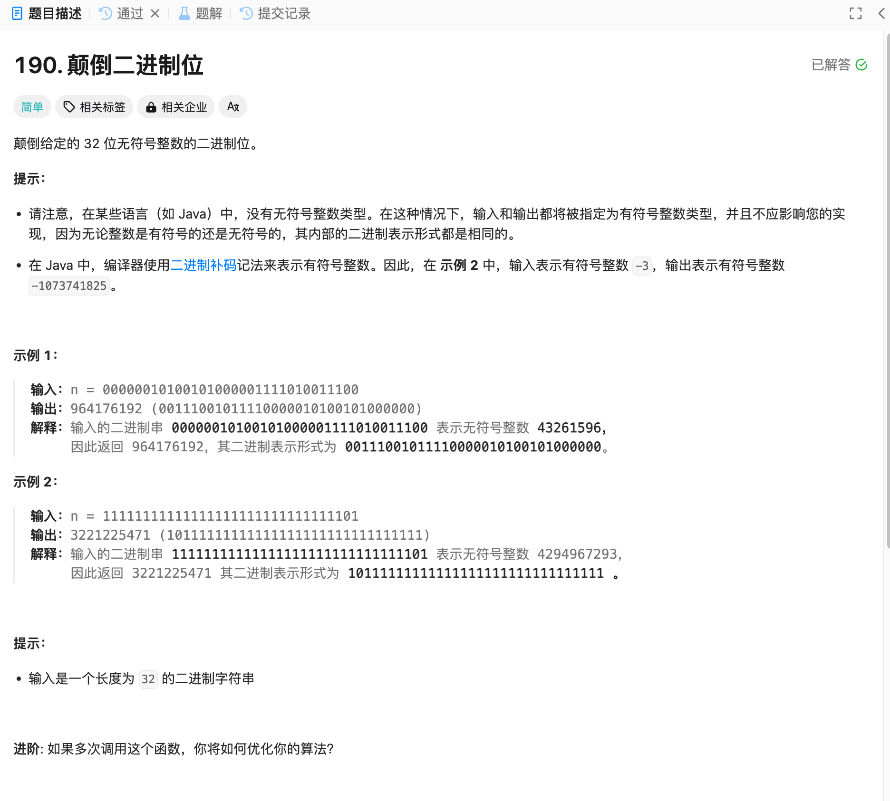

# 190. 颠倒二进制位
## 题目链接  
[190. 颠倒二进制位](https://leetcode.cn/problems/reverse-bits/description/)
## 题目详情


***
## 解答一
答题者：EchoBai

### 题解
仔细分析可以发现，十进制转二进制的过程得到的二进制序列恰好就是颠倒的，因此只需重新计算即可。

### 代码
``` cpp
class Solution {
public:
    uint32_t reverseBits(uint32_t n) {
        int cnt = 31;
        uint32_t res = 0;

        while(n > 0){
            if(n % 2 == 1){
                res += pow(2,cnt);
            }
            n /=  2;
            --cnt;
        }

        return res;
    }
};
```


