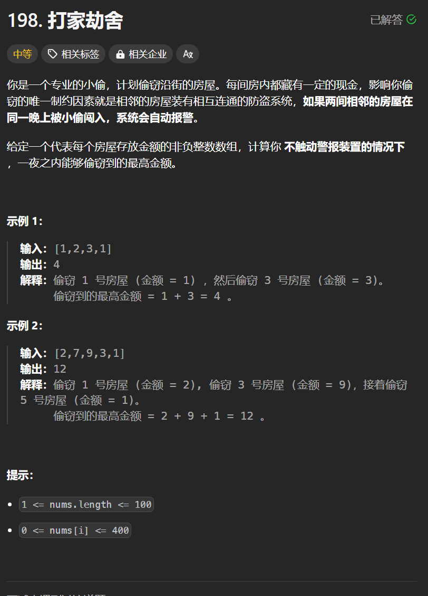

# 198. 打家劫舍
## 题目链接  
[198. 打家劫舍](https://leetcode.cn/problems/house-robber/)
## 题目详情


***
## 解答一
答题者：**Yuiko630**

### 题解
> 当前状态是由前面的状态决定的，dp，五部曲
>1. 定义:dp[i]表示包括i以内的房间，最多可以偷dp[i]金额
>2. 转移方程:dp[i] = max(dp[i-1], dp[i-2]+values[i])
>3. 初始化:dp[0]=values[0], dp[1]=max(value[0], values[1])，注意长度为1时直接返回dp[0]
>4. 遍历:单层遍历房间即可
>5. 推导

### 代码
``` Java
class Solution {
    public int rob(int[] nums) {
        int[] dp = new int[nums.length];
        dp[0] = nums[0];
        if(nums.length == 1) return dp[0];
        dp[1] = Math.max(nums[0], nums[1]);
        for(int i = 2;i < nums.length; i++){
            dp[i] = Math.max(dp[i-2] + nums[i], dp[i-1]);
        }
        return dp[nums.length - 1];
    }
}
```