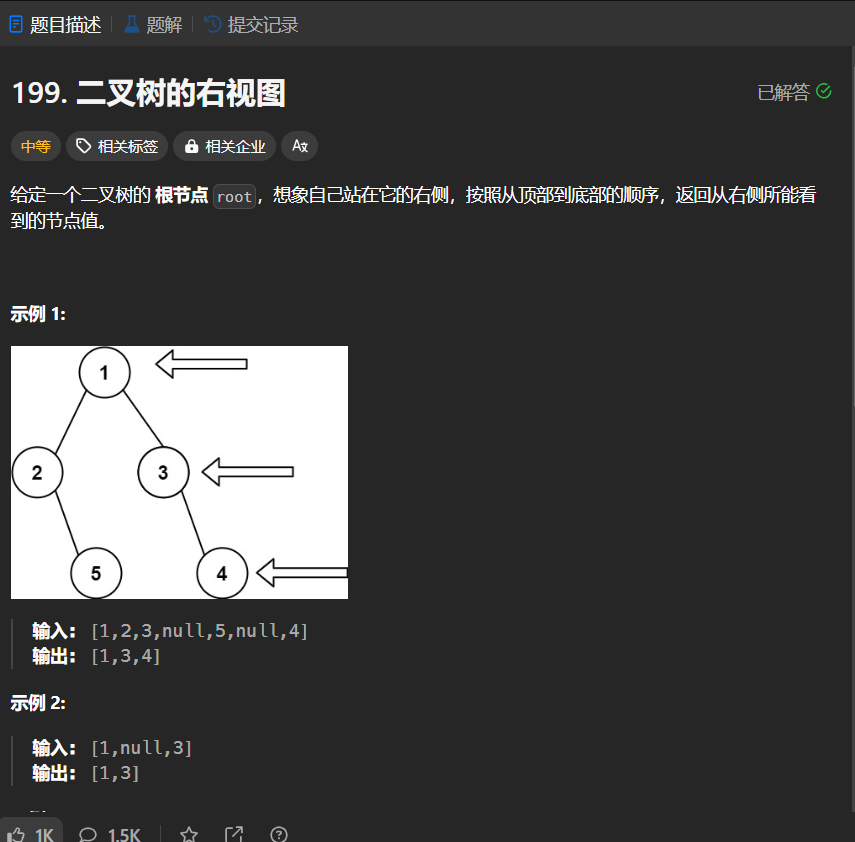

# 199. 二叉树的右视图
## 题目链接  
[199. 二叉树的右视图](https://leetcode.cn/problems/binary-tree-right-side-view/description/?envType=study-plan-v2&envId=top-interview-150)
## 题目详情


***
## 解答一
答题者：EchoBai

### 题解
层序遍历将队列最后一个元素压入`vector`中即可。

### 代码
``` cpp
/**
 * Definition for a binary tree node.
 * struct TreeNode {
 *     int val;
 *     TreeNode *left;
 *     TreeNode *right;
 *     TreeNode() : val(0), left(nullptr), right(nullptr) {}
 *     TreeNode(int x) : val(x), left(nullptr), right(nullptr) {}
 *     TreeNode(int x, TreeNode *left, TreeNode *right) : val(x), left(left), right(right) {}
 * };
 */
class Solution {
public:
    vector<int> rightSideView(TreeNode* root) {
        vector<int> res;
        levelOrder(root,res);
        return res;
    }
    void levelOrder(TreeNode* root, vector<int> &res){
        if(!root) return;
        queue<TreeNode*> q;
        q.push(root);
        while(!q.empty()){
            res.push_back(q.back()->val);
            for(int i = q.size(); i > 0; --i){
                TreeNode* e = q.front();
                q.pop();
                if(e->left) q.push(e->left);
                if(e->right) q.push(e->right);
            }
        }
    }
};
```


