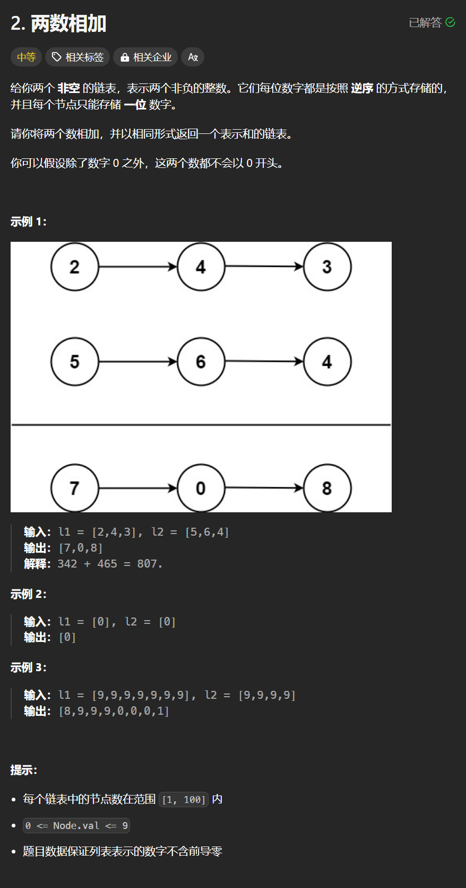

# 2. 两数相加
## 题目链接  
[2. 两数相加](https://leetcode.cn/problems/two-sum/)
## 题目详情


***
## 解答一
答题者：**Yuiko630**

### 题解
>递归和迭代都行，重要的是别忘了进位，以及最后的进位。

### 代码
``` Java
/**
 * Definition for singly-linked list.
 * public class ListNode {
 *     int val;
 *     ListNode next;
 *     ListNode() {}
 *     ListNode(int val) { this.val = val; }
 *     ListNode(int val, ListNode next) { this.val = val; this.next = next; }
 * }
 */
class Solution {
    public ListNode add(ListNode l1, ListNode l2, int signal){
        if(l1 != null && l2 != null){
            int sum = l1.val + l2.val + signal;
            signal = sum / 10;
            ListNode node = new ListNode(sum%10);
            node.next = add(l1.next, l2.next, signal);
            return node;
        }
        else if(l1 == null && l2 != null){
            int sum = l2.val + signal;
            signal = sum / 10;
            ListNode node = new ListNode(sum%10);
            node.next = add(null, l2.next, signal);
            return node;
        }
        else if(l2 == null && l1 != null){
            int sum = l1.val + signal;
            signal = sum / 10;
            ListNode node = new ListNode(sum%10);
            node.next = add(l1.next, null, signal);
            return node;
        }
        else {
            if(signal != 0){
                ListNode node = new ListNode(signal);
                return node;
            }
            else return null;
        }
    }
    public ListNode addTwoNumbers(ListNode l1, ListNode l2) {
        int signal = 0;
        ListNode head = add(l1, l2, signal);
        return head;
    }
}
```

```java
/**
 * Definition for singly-linked list.
 * public class ListNode {
 *     int val;
 *     ListNode next;
 *     ListNode() {}
 *     ListNode(int val) { this.val = val; }
 *     ListNode(int val, ListNode next) { this.val = val; this.next = next; }
 * }
 */
class Solution {
    public ListNode addTwoNumbers(ListNode l1, ListNode l2) {
        ListNode head = new ListNode(0);
        ListNode cur = head;
        int signal = 0;
        while(l1 != null && l2 != null) {
            int sum = l1.val + l2.val + signal;
            signal = sum / 10;
            ListNode node = new ListNode(sum%10);
            l1 = l1.next;
            l2 = l2.next;
            cur.next = node;
            cur = cur.next;
        }
        ListNode p = l1 == null? l2:l1;
        while(p != null){
            int sum = p.val + signal;
            signal = sum / 10;
            ListNode node = new ListNode(sum%10);
            p = p.next;
            cur.next = node;
            cur = cur.next;
        }
        if(signal != 0){
            ListNode node = new ListNode(signal);
            cur.next = node;
        }
        return head.next;
    }
}
```