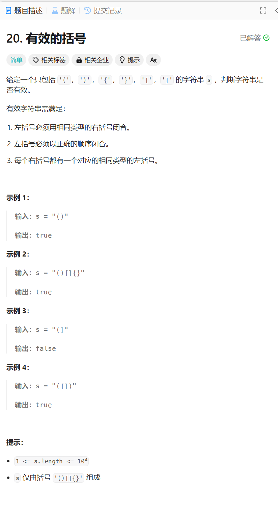

# 20. 有效的括号
## 题目链接  
[20. 有效的括号](https://leetcode.cn/problems/valid-parentheses/description/)
## 题目详情


## 解答一
答题者：**Yuiko630**

### 题解
>遍历一遍字符串，如果是左括号用stack保存，如果是右括号判断stack是否为空，空则返回false，不空则比较栈顶元素是否匹配右括号。最后判断栈是否为空。

### 代码
``` Java
class Solution {
    public boolean isValid(String s) {
        Stack<Character> stack = new Stack<>();
        for(int i = 0; i < s.length(); i ++){
            if(s.charAt(i) == '(' || s.charAt(i) == '{' || s.charAt(i) == '['){
                stack.push(s.charAt(i));
            }
            else{
                if(stack.isEmpty()) return false;
                else if(s.charAt(i) == ')'){
                    if(stack.pop() != '(') return false;
                }
                else if(s.charAt(i) == '}'){
                    if(stack.pop() != '{') return false;
                }
                else if(s.charAt(i) == ']'){
                    if(stack.pop() != '[') return false;
                }
                else return false;
            }
        }
        if(stack.isEmpty())
            return true;
        else return false;
    }
}
```