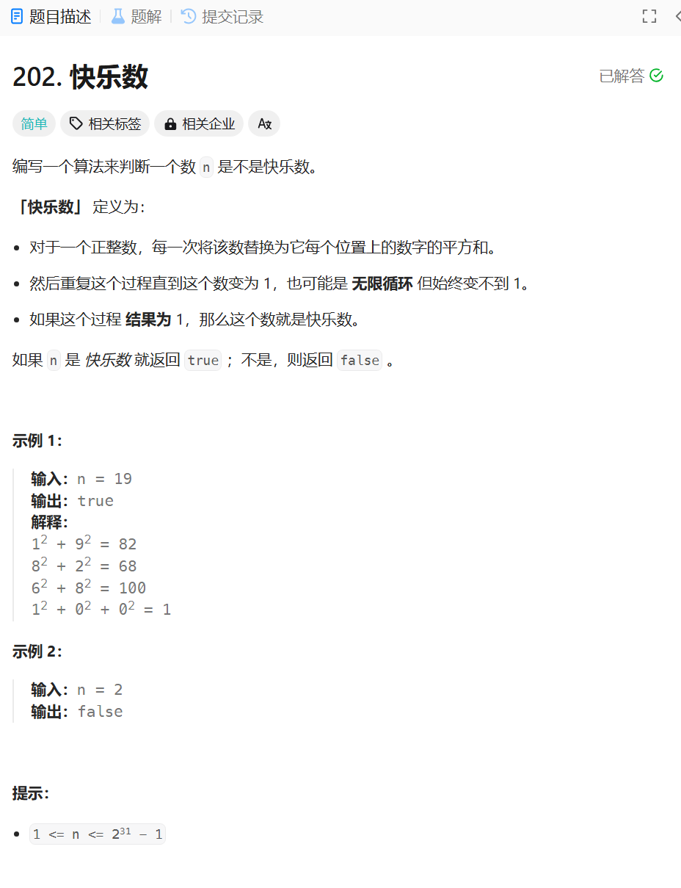

# 202. 快乐数
## 题目链接  
[202. 快乐数](https://leetcode.cn/problems/isomorphic-strings/)
## 题目详情


***
## 解答一
答题者：**Yuiko630**

### 题解
>用sum记录当前值的各位平方和，temp记录当前值，如果当前sum为1，则返回true，然后sum赋值给temp后清零开始下一轮计算。有一个规律是无限循环中一定包含4或16，因此只要temp出现4直接返回false，

### 代码
``` Java
class Solution {
    public boolean isHappy(int n) {
        if(n == 1) return true;
        int sum = 0;
        int temp = n;
        while(temp != 0){
            while(temp != 0){
                sum += Math.pow(temp%10, 2);
                temp = temp/10;
            }
            if(sum == 1) return true;
            temp = sum;
            if(temp == 4) return false;
            sum = 0;
        }
        return false;
    }
}
```


