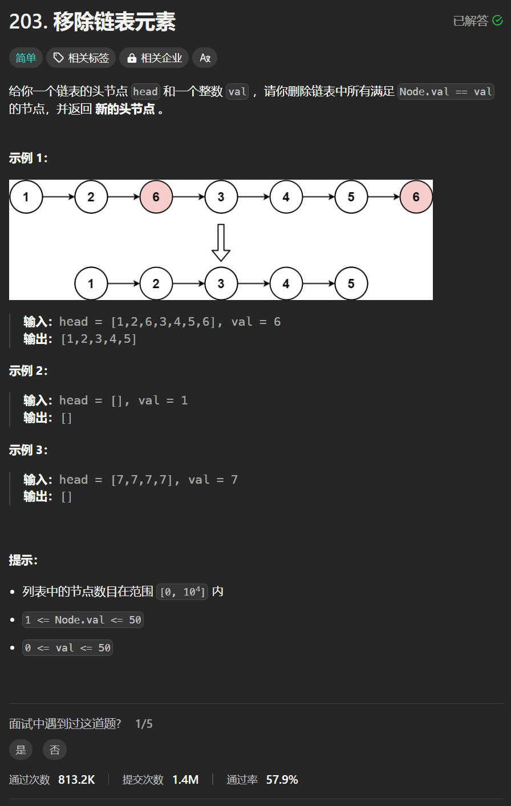

# 203. 移除链表元素
## 题目链接  
[203. 移除链表元素](https://leetcode.cn/problems/remove-linked-list-elements/)
## 题目详情


***
## 解答一
答题者：**Yuiko630**

### 题解
>新建一个虚拟头节点，这样不需要对头节点专门判断，最后返回dummyNode.next。

### 代码
``` Java
/**
 * Definition for singly-linked list.
 * public class ListNode {
 *     int val;
 *     ListNode next;
 *     ListNode() {}
 *     ListNode(int val) { this.val = val; }
 *     ListNode(int val, ListNode next) { this.val = val; this.next = next; }
 * }
 */
class Solution {
    public ListNode removeElements(ListNode head, int val) {
        ListNode dummyNode = new ListNode(0, head);
        ListNode cur = dummyNode;
        while(cur.next != null){
            if(cur.next.val == val){
                cur.next = cur.next.next;
            }
            else{
                cur = cur.next;
            }
        }
        return dummyNode.next;
    }
}
```


