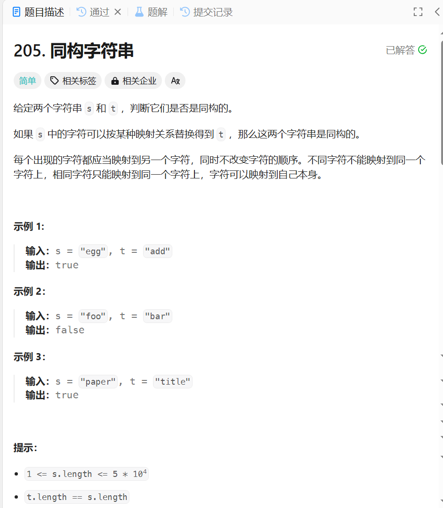

# 215. 同构字符串
## 题目链接  
[215. 同构字符串](https://leetcode.cn/problems/isomorphic-strings/)
## 题目详情


***
## 解答一
答题者：**Yuiko630**

### 题解
>使用哈希表，存放s的字符到t的字符映射，遍历s，如果存放过该键则比较值是否相同，如果没存放过该键则查值是否被存放过，值存过则false，否则添加新的映射关系。

### 代码
``` Java
class Solution {
    public boolean isIsomorphic(String s, String t) {
        if(s.length() != t.length()) return false;
        Map<Character, Character> record = new HashMap<Character, Character>();
        for(int i = 0; i < s.length(); i++){
            if(record.containsKey(s.charAt(i))){
                if(!record.get(s.charAt(i)).equals(t.charAt(i))) return false;
            }
            else{
                if(record.containsValue(t.charAt(i))) return false;
                record.put(s.charAt(i), t.charAt(i));
            }
        }
        return true;
    }
}
```


