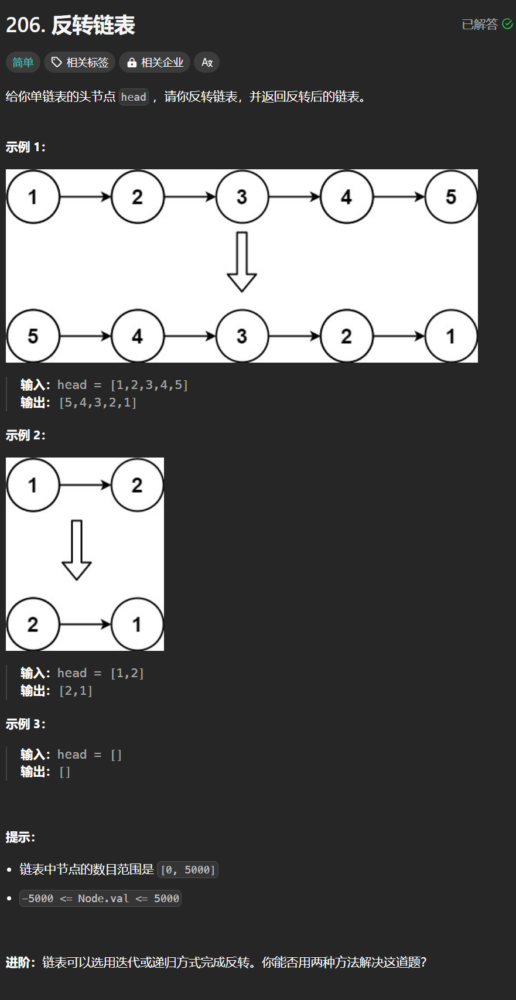

# 206. 反转链表
## 题目链接  
[206. 反转链表](https://leetcode.cn/problems/isomorphic-strings/)
## 题目详情


***
## 解答一
答题者：**Yuiko630**

### 题解
>双指针，pre，cur，迭代反转即可。

### 代码
``` Java
/**
 * Definition for singly-linked list.
 * public class ListNode {
 *     int val;
 *     ListNode next;
 *     ListNode() {}
 *     ListNode(int val) { this.val = val; }
 *     ListNode(int val, ListNode next) { this.val = val; this.next = next; }
 * }
 */
class Solution {
    public ListNode reverseList(ListNode head) {
        if(head == null || head.next == null) return head;
        ListNode pre = head;
        ListNode cur = head.next;
        pre.next = null;
        while(cur != null){
            ListNode tmp = cur.next;
            cur.next = pre;
            pre = cur;
            cur = tmp;
        }
        return pre;
    }
}
```
***
## 解答二
答题者：**Yuiko630**

### 题解
>递归。

### 代码
``` Java
/**
 * Definition for singly-linked list.
 * public class ListNode {
 *     int val;
 *     ListNode next;
 *     ListNode() {}
 *     ListNode(int val) { this.val = val; }
 *     ListNode(int val, ListNode next) { this.val = val; this.next = next; }
 * }
 */
class Solution {
    public ListNode reverseList(ListNode head) {
        if(head == null || head.next == null) return head;
        ListNode newHead = reverseList(head.next);
        head.next.next = head;
        head.next = null;
        return newHead;
    }
}
```