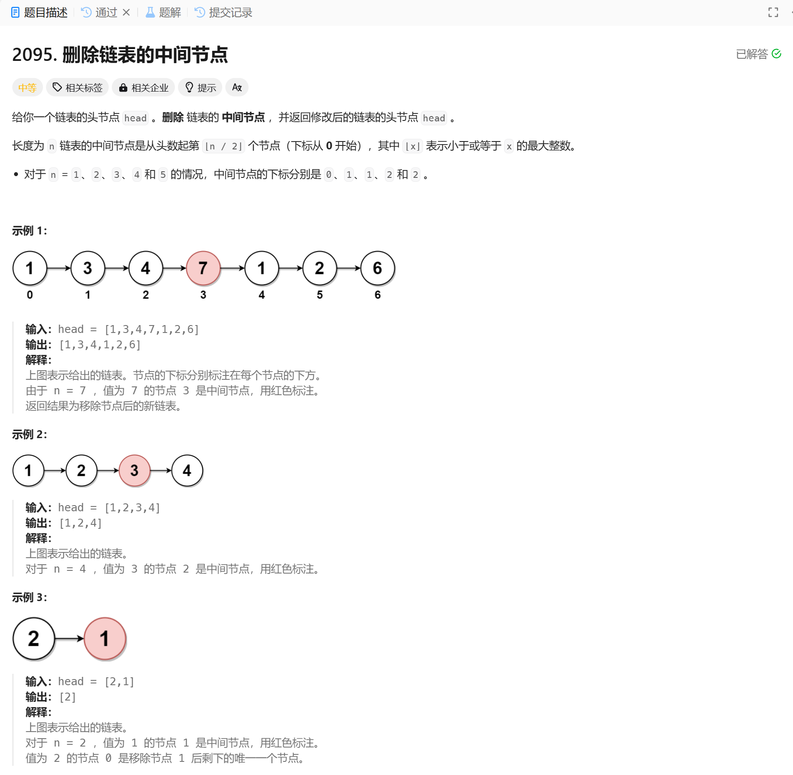

# 2095. 删除链表的中间节点
## 题目链接  
[2095. 删除链表的中间节点](https://leetcode.cn/problems/delete-the-middle-node-of-a-linked-list/description/)
## 题目详情


***
## 解答一
答题者：EchoBai

### 题解
快慢指针找到中间节点即可

### 代码
``` cpp
/**
 * Definition for singly-linked list.
 * struct ListNode {
 *     int val;
 *     ListNode *next;
 *     ListNode() : val(0), next(nullptr) {}
 *     ListNode(int x) : val(x), next(nullptr) {}
 *     ListNode(int x, ListNode *next) : val(x), next(next) {}
 * };
 */
class Solution {
public:
    ListNode* deleteMiddle(ListNode* head) {
        if (!head || !head->next) return nullptr;

        ListNode* slow = head;
        ListNode* fast = head;
        ListNode* prev = nullptr;

        while (fast && fast->next) {
            prev = slow;
            slow = slow->next;
            fast = fast->next->next;
        }

        if (prev) {
            prev->next = slow->next;
        }
        
        return head;
    }
};
```
