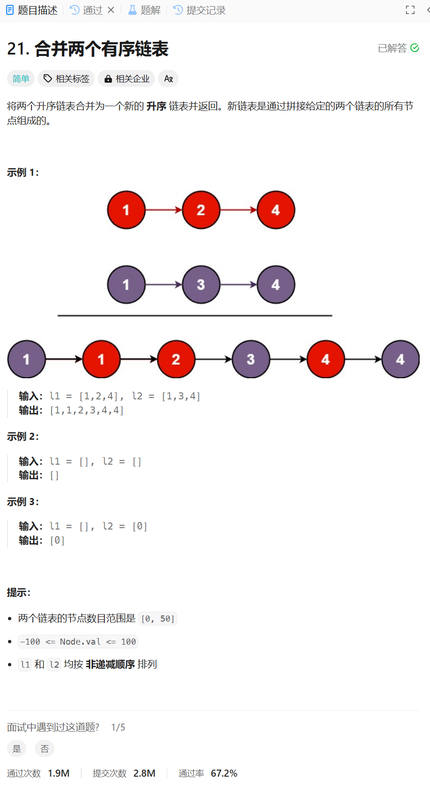

# 21. 合并两个有序链表
## 题目链接  
[21. 合并两个有序链表](https://leetcode.cn/problems/merge-two-sorted-lists/description/)
## 题目详情


## 解答一
答题者：**Yuiko630**

### 题解
>先创建一个虚拟头节点dummyHead，尾巴tail指向头，遍历比较list1和list2，把当前更小的数更新为tail.next，tail往后移。最后看谁还有剩余，把剩余加在tail.next上。返回dummyHead.next。

### 代码
``` Java
/**
 * Definition for singly-linked list.
 * public class ListNode {
 *     int val;
 *     ListNode next;
 *     ListNode() {}
 *     ListNode(int val) { this.val = val; }
 *     ListNode(int val, ListNode next) { this.val = val; this.next = next; }
 * }
 */
class Solution {
    public ListNode mergeTwoLists(ListNode list1, ListNode list2) {
        if (list1 == null) return list2;
        else if (list2 == null) return list1;
        ListNode dummyHead = new ListNode(0);
        ListNode tail = dummyHead;
        while (list1 != null && list2 != null) {
            if (list1.val < list2.val) {
                tail.next = list1;
                list1 = list1.next;
            } 
            else {
                tail.next = list2;
                list2 = list2.next;
            }
            tail = tail.next;
        }
        tail.next = (list1 != null) ? list1 : list2;
        return dummyHead.next;
    }
}
```