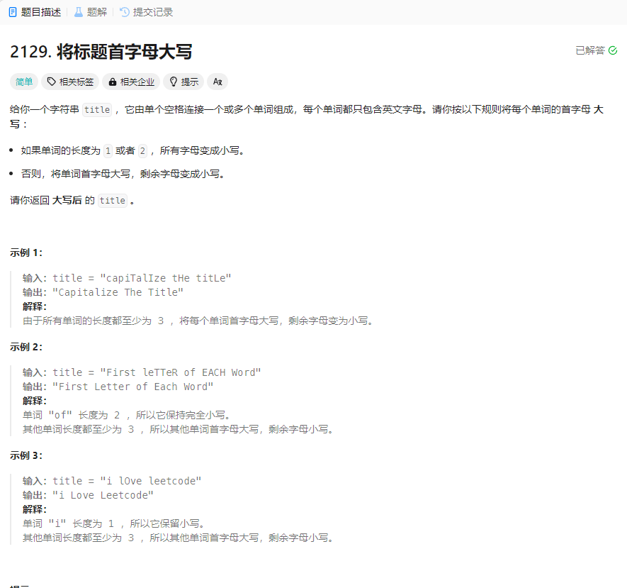

# 2129. 将标题首字母大写
## 题目链接  
[2129. 将标题首字母大写](https://leetcode.cn/problems/capitalize-the-title/description/?envType=daily-question&envId=2024-03-11)
## 题目详情


***
## 解答一
答题者：EchoBai

### 题解
先将原始字符串按空格切分然后分别按题意处理即可。

### 代码
``` cpp
class Solution {
public:
    string capitalizeTitle(string title) {
        vector<string> res = split(title," ");
        string ans;
        for(int i = 0; i < res.size() - 1; ++i){
            ans += judegeAndHandle(res[i]);
            ans += " ";
        }
        ans += judegeAndHandle(res[res.size()-1]);
        return ans;
    }
    string judegeAndHandle(string &s){
        int len = s.size();
        if(len <= 2){
            for(int i = 0; i < len; ++i){
                if( s[i] >= 'A' && s[i] <= 'Z')
                    s[i] = tolower(s[i]);
            }
        }else{
            s[0] = toupper(s[0]);
            for(int i = 1; i < len; ++i){
                if( s[i] >= 'A' && s[i] <= 'Z')
                    s[i] = tolower(s[i]);
            }
        }
        return s;
    }
    vector<string> split(const string& str, const string& delim) {
        vector<string> res;
        if("" == str) return res;
        //先将要切割的字符串从string类型转换为char*类型
        char * strs = new char[str.length() + 1] ; //不要忘了
        strcpy(strs, str.c_str()); 

        char * d = new char[delim.length() + 1];
        strcpy(d, delim.c_str());

        char *p = strtok(strs, d);
        while(p) {
            string s = p; //分割得到的字符串转换为string类型
            res.push_back(s); //存入结果数组
            p = strtok(NULL, d);
        }

        return res;
    }
};
```

