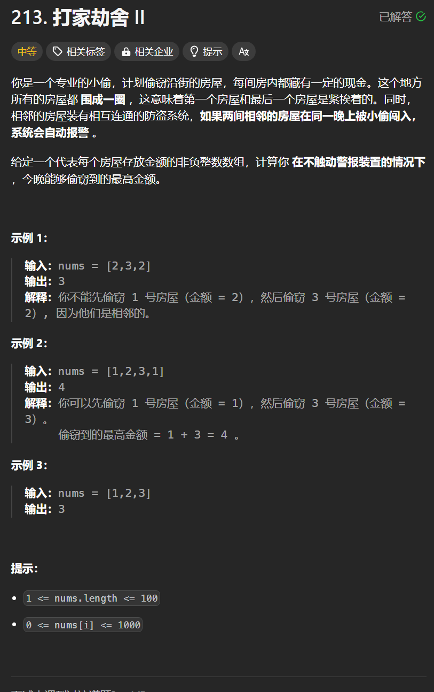

# 213. 打家劫舍II
## 题目链接  
[213. 打家劫舍II](https://leetcode.cn/problems/house-robber-ii/)
## 题目详情


***
## 解答一
答题者：**Yuiko630**

### 题解
> 当前状态是由前面的状态决定的，dp，五部曲
>1. 定义:dp[i]表示包括i以内的房间，最多可以偷dp[i]金额
>2. 转移方程:dp[i] = max(dp[i-1], dp[i-2]+values[i])
>3. 初始化:dp[0]=values[0], dp[1]=max(value[0], values[1])，注意长度为1时直接返回dp[0]
>4. 遍历:单层遍历房间即可
>5. 推导:头尾相连，分开考虑，只有头的情况和只有尾的情况取最大值

### 代码
``` Java
class Solution {
    public int rob(int[] nums) {
        if(nums.length == 1) return nums[0];
        int con1 = robPart(nums, 0, nums.length-2);
        int con2 = robPart(nums, 1, nums.length-1);
        return Math.max(con1, con2);
    }
    public int robPart(int[] nums, int start, int end) {
        int[] dp = new int[nums.length];
        dp[start] = nums[start];
        if(start == end) return dp[start];
        dp[start + 1] = Math.max(nums[start], nums[start+1]);
        for(int i = start+2; i < nums.length; i++){
            dp[i] = Math.max(dp[i-2] + nums[i], dp[i-1]);
        }
        return dp[end];
    }
}
```