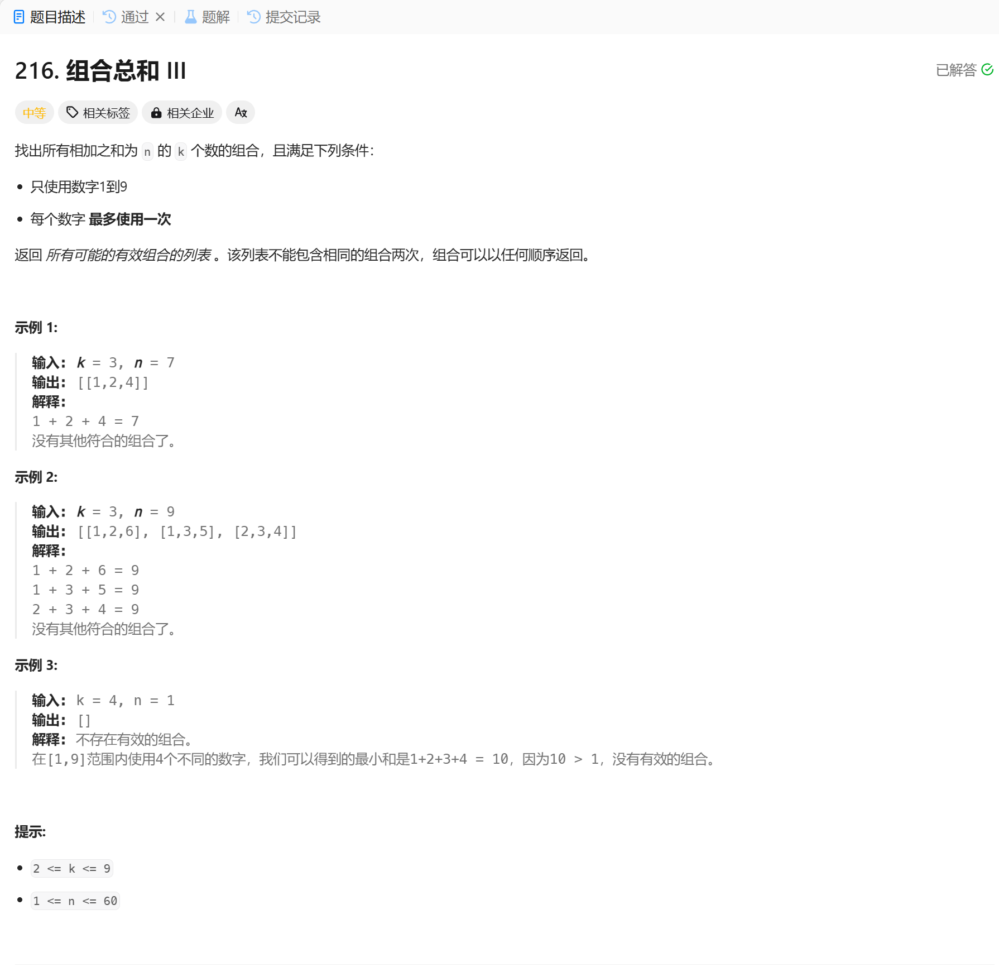

# 216. 组合总和 III
## 题目链接  
[216. 组合总和 III](https://leetcode.cn/problems/combination-sum-iii/description/)
## 题目详情


***
## 解答一
答题者：EchoBai

### 题解
递归 + 回溯， 终止条件就2个，一是满足所需元素个数，二是当前元素总和等于 n。

### 代码
``` cpp
class Solution {
public:
    vector<vector<int>> res;
    vector<int> comb;
    vector<vector<int>> combinationSum3(int k, int n) {
        backtracking(n, k, 1);
        return res;
    }

    void backtracking(int n, int k, int startIdx){
        if(comb.size() == k ){
            if(accumulate(comb.begin(), comb.end(), 0) == n){
                res.push_back(comb);
                return;
            }
        }

        for(int i = startIdx; i <= 9; ++i){
            comb.push_back(i);
            backtracking(n, k, i + 1);
            comb.pop_back();
        }
    }
};
```
