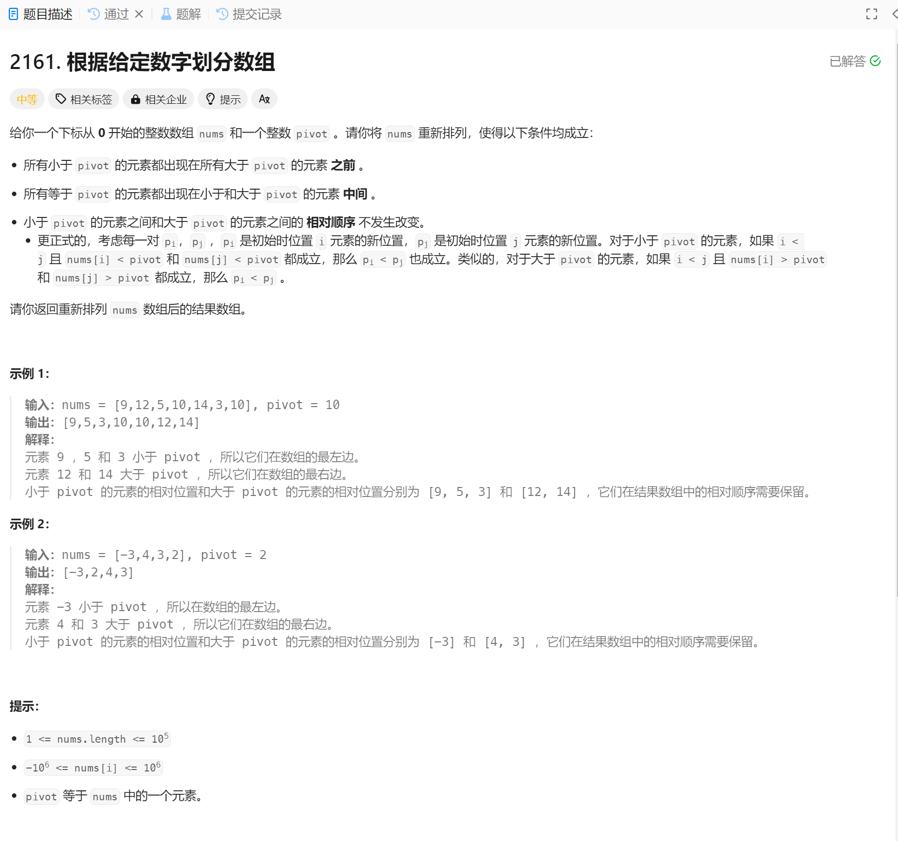

# 2161. 根据给定数字划分数组
## 题目链接  
[2161. 根据给定数字划分数组](https://leetcode.cn/problems/partition-array-according-to-given-pivot/description/)
## 题目详情


***
## 解答一
答题者：EchoBai

### 题解
将原数组分为三个部分，小于放左边，大于放右边，统计中间个数，最后合并起来就行

### 代码
``` cpp
class Solution {
public:
    vector<int> pivotArray(vector<int>& nums, int pivot) {
        std::vector<int> left;
        std::vector<int> right;
        int cnt = 0;
        for(auto e : nums){
            if(e < pivot){
                left.emplace_back(e);
            }else if(e == pivot){
                ++cnt;
            }else{
                right.emplace_back(e);
            }
        }
        for(auto c = 0; c < cnt; ++c)
            left.emplace_back(pivot);
        left.insert(left.end(),right.begin(),right.end());
        return left;
    }
};
```
