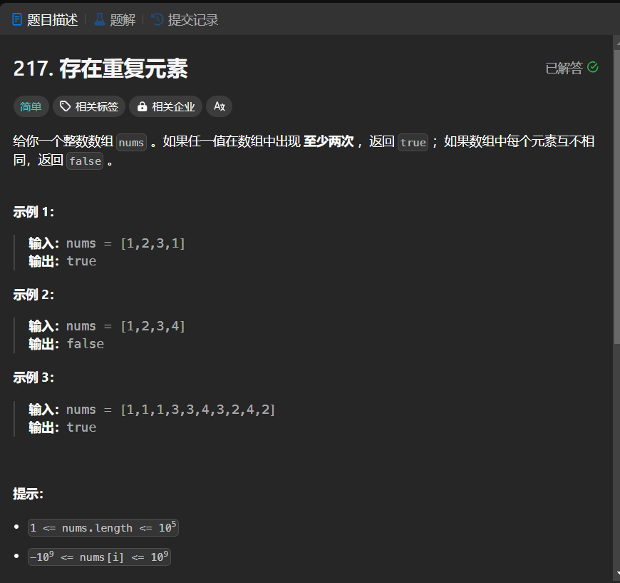

# 217. 存在重复元素
## 题目链接  
[217. 存在重复元素](https://leetcode.cn/problems/contains-duplicate/)
## 题目详情


***
## 解答一
答题者：EchoBai

### 题解
使用哈希表，当哈希表中存在当前元素则取出该元素下标与当前下标进行比较，如果满足就返回true,否则返回`false`;

### 代码
``` cpp
class Solution {
public:
    bool containsDuplicate(vector<int>& nums) {
        map<int,int> m;
        int len = nums.size();
        if(len <= 1) return false;
        for(int i = 0; i < len; ++i){
            ++m[nums[i]];
            if(m[nums[i]] > 1) 
                return true;
        }
        return false;
    }
};
```


