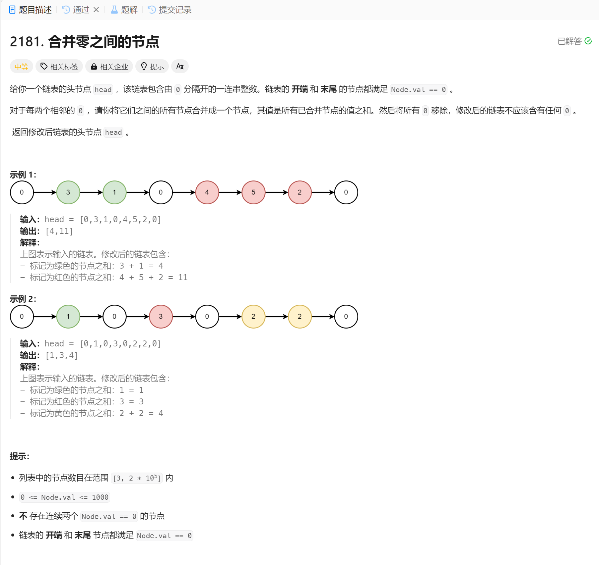

# 2181. 合并零之间的节点
## 题目链接  
[2181. 合并零之间的节点]https://leetcode.cn/problems/merge-nodes-in-between-zeros/description/?envType=daily-question&envId=2024-10-29)
## 题目详情


***
## 解答一
答题者：EchoBai

### 题解
从第二个节点开始，在每次遇到0的时候将当前和构造为一个新节点，然后重新组合链表即可。

### 代码
``` cpp
/**
 * Definition for singly-linked list.
 * struct ListNode {
 *     int val;
 *     ListNode *next;
 *     ListNode() : val(0), next(nullptr) {}
 *     ListNode(int x) : val(x), next(nullptr) {}
 *     ListNode(int x, ListNode *next) : val(x), next(next) {}
 * };
 */
class Solution {
public:
    ListNode* mergeNodes(ListNode* head) {
        ListNode* ret = new ListNode(-1);
        ListNode* ptr = head->next;
        head = ret;
        int sum = 0;

        while(ptr){
            if(ptr->val != 0){
                sum += ptr->val;
            }else{
                ListNode* e = new ListNode(sum);
                ret->next = e;
                ret = ret->next;
                sum = 0;
            }
            ptr = ptr->next;
        }


        return head->next;
    }
};
```
