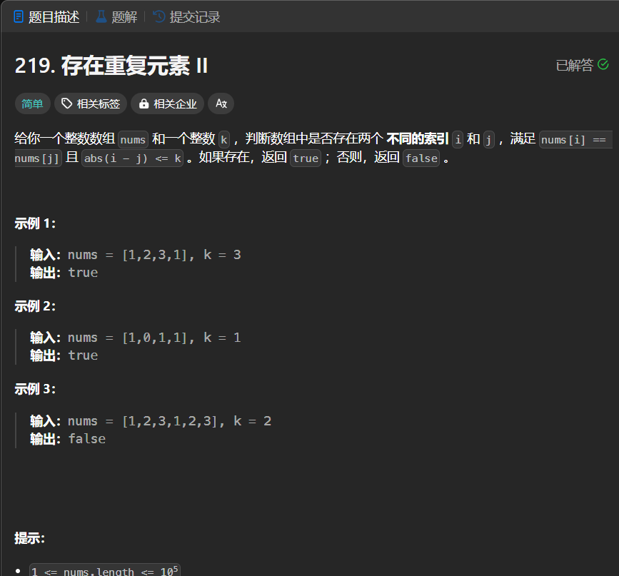

# 219. 存在重复元素 II
## 题目链接  
[219. 存在重复元素 II](https://leetcode.cn/problems/contains-duplicate-ii/description/?envType=study-plan-v2&envId=top-interview-150)
## 题目详情


***
## 解答一
答题者：EchoBai

### 题解
使用哈希表，当哈希表中存在当前元素则取出该元素下标与当前下标进行比较，如果满足就返回true,否则返回`false`;

### 代码
``` cpp
class Solution {
public:
    bool containsNearbyDuplicate(vector<int>& nums, int k) {
        int len = nums.size();
        map<int,int>m;
        for(int i = 0; i < len; ++i){
            if(m.find(nums[i]) != m.end()){
                if( i - m[nums[i]] <= k)
                    return true;
            }
            m[nums[i]] = i;
        }
        return false;
    }
};
```


