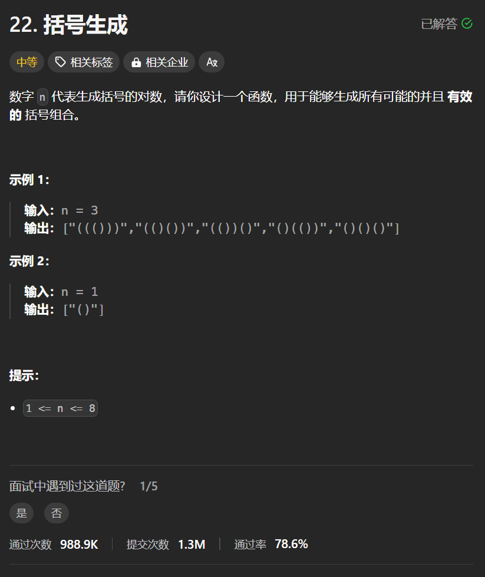

# 22. 括号生成
## 题目链接  
[22. 括号生成](https://leetcode.cn/problems/generate-parentheses/description/)
## 题目详情


## 解答一
答题者：**Yuiko630**

### 题解
>递归+回溯，左括号数量不大于 n，右括号数量小于左括号的数量。终止条件为字符串长度为2n

### 代码
``` Java
class Solution {
    ArrayList<String> result = new ArrayList<>();
    StringBuilder res = new StringBuilder();
    int resLen = 0;
    public List<String> generateParenthesis(int n) {
        backtrack(n, 0, 0);
        return result;
    }
    public void backtrack(int n, int left, int right){
        if(res.length() == 2*n){
            result.add(res.toString());
            return;
        }
        if(left < n){
            res.append('(');
            backtrack(n, left+1, right);
            res.deleteCharAt(res.length() - 1);
        }
        if(right < left){
            res.append(')');
            backtrack(n, left, right+1);
            res.deleteCharAt(res.length() - 1);
        }
    }
}
```