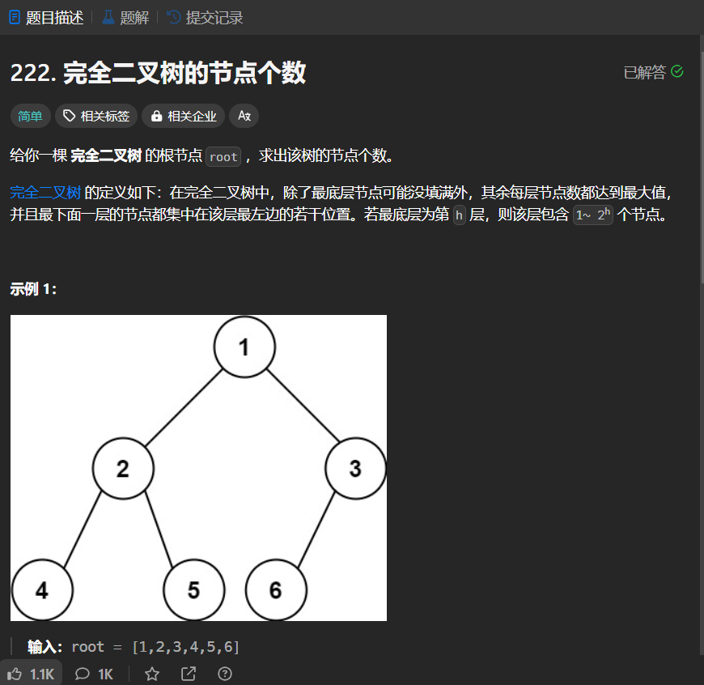

# 222. 完全二叉树的节点个数
## 题目链接  
[222. 完全二叉树的节点个数](https://leetcode.cn/problems/count-complete-tree-nodes/description/?envType=study-plan-v2&envId=top-interview-150)
## 题目详情


***
## 解答一
答题者：EchoBai

### 题解
递归即可，存在节点，计数加加。

### 代码
``` cpp
/**
 * Definition for a binary tree node.
 * struct TreeNode {
 *     int val;
 *     TreeNode *left;
 *     TreeNode *right;
 *     TreeNode() : val(0), left(nullptr), right(nullptr) {}
 *     TreeNode(int x) : val(x), left(nullptr), right(nullptr) {}
 *     TreeNode(int x, TreeNode *left, TreeNode *right) : val(x), left(left), right(right) {}
 * };
 */
class Solution {
public:
    int countNodes(TreeNode* root) {
        int res = 0;
        count(root,res);
        return res;
    }
    void count(TreeNode* root, int &cnt){
        if(!root) return;
        if(root) ++cnt;
        count(root->left,cnt);
        count(root->right,cnt);
    }
};
```


