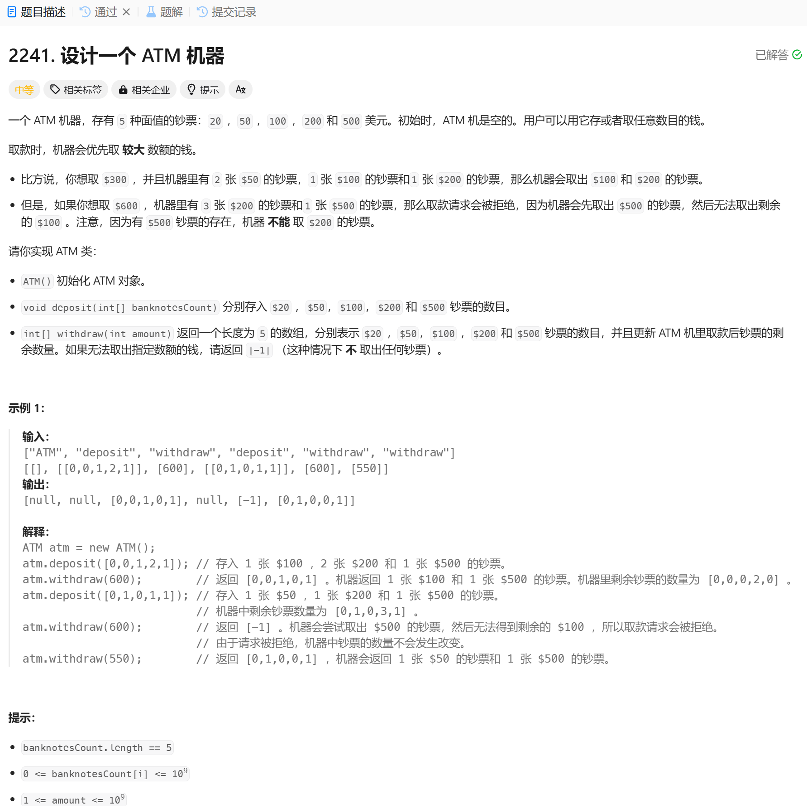

# 2241. 设计一个 ATM 机器
## 题目链接  
[2241. 设计一个 ATM 机器](https://leetcode.cn/problems/design-an-atm-machine/description/?envType=daily-question&envId=2025-01-05)
## 题目详情


***
## 解答一
答题者：EchoBai

### 题解
模拟题目过程即可。

### 代码
``` cpp
class ATM {
private:
    vector<int> records;
    vector<int> denominations = {20, 50, 100, 200, 500}; 
public:
    ATM(): records(5, 0){
        
    }
    
    void deposit(vector<int> banknotesCount) {
        for(int i = 0; i < 5; ++i){
            records[i] += banknotesCount[i];
        }
        
    }
    
    vector<int> withdraw(int amount) {
        vector<int> res(5, 0);
        for(int i = 4; i >= 0; --i){
            if(records[i] > 0){
                int r = std::min(amount / denominations[i], records[i]);
                res[i] = r;
                amount -= r * denominations[i];
            }
        }
        if(amount > 0){
            return {-1};
        }
        for(int i = 0; i < records.size(); ++i){
            records[i] -= res[i];
        }
        return res;
    }
};

/**
 * Your ATM object will be instantiated and called as such:
 * ATM* obj = new ATM();
 * obj->deposit(banknotesCount);
 * vector<int> param_2 = obj->withdraw(amount);
 */
```
