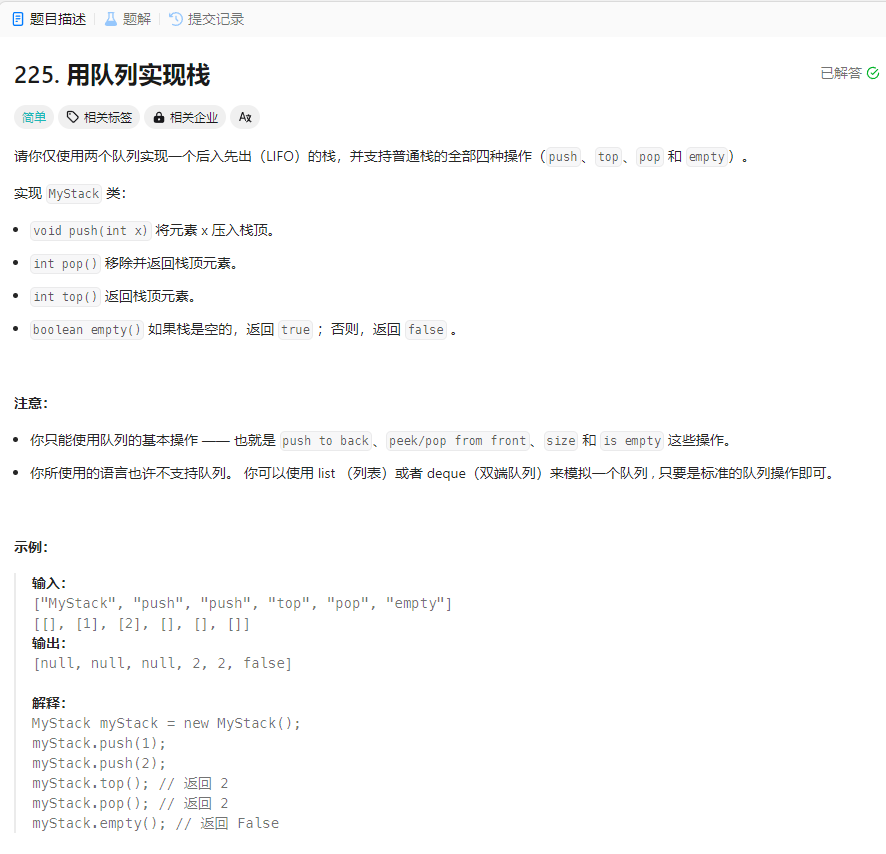

# 225. 用队列实现栈
## 题目链接  
[225. 用队列实现栈](https://leetcode.cn/problems/implement-stack-using-queues/description/?envType=daily-question&envId=2024-03-03)
## 题目详情


***
## 解答一
答题者：EchoBai

### 题解
dddd

### 代码
``` cpp
class MyStack {
private:
    queue<int> pre;
    queue<int> last;
public:
    MyStack() {

    }
    
    void push(int x) {
        pre.push(x);
    }
    
    int pop() {
        int e = pre.back();
        while(pre.size() > 1){
            last.push(pre.front());
            pre.pop();
        }
        pre.pop();
        while(!last.empty()){
            pre.push(last.front());
            last.pop();
        }
        return e;
    }
    
    int top() {
        return pre.back();
    }
    
    bool empty() {
        return pre.empty();
    }
};

/**
 * Your MyStack object will be instantiated and called as such:
 * MyStack* obj = new MyStack();
 * obj->push(x);
 * int param_2 = obj->pop();
 * int param_3 = obj->top();
 * bool param_4 = obj->empty();
 */
```

## 解答二
答题者：**Yuiko630**

### 题解
>两个队列模拟栈，在进栈时先进queue2，再把queue1的加到尾巴，最后倒回queue1即可实现先进先出。

### 代码
``` Java
class MyStack {
    Queue<Integer> queue1;
    Queue<Integer> queue2;

    public MyStack() {
        queue1 = new ArrayDeque<>();
        queue2 = new ArrayDeque<>();
    }
    
    public void push(int x) {
        queue2.offer(x);
        while(!queue1.isEmpty()){
            queue2.offer(queue1.poll());
        }
        Queue<Integer> tmp = queue1;
        queue1 = queue2;
        queue2 = tmp;
    }
    
    public int pop() {
        return queue1.poll();
    }
    
    public int top() {
        return queue1.peek();
    }
    
    public boolean empty() {
        return queue1.isEmpty();
    }
}

/**
 * Your MyStack object will be instantiated and called as such:
 * MyStack obj = new MyStack();
 * obj.push(x);
 * int param_2 = obj.pop();
 * int param_3 = obj.top();
 * boolean param_4 = obj.empty();
 */