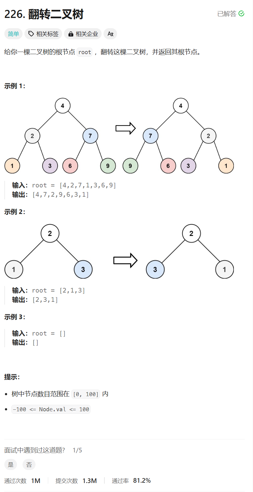

# 226. 翻转二叉树
## 题目链接  
[226. 翻转二叉树](https://leetcode.cn/problems/invert-binary-tree/description/)
## 题目详情


***
## 解答一
答题者：**Yuiko630**

### 题解
>递归。如果为空返回null，否则翻转左节点和右节点，并交换左右节点的值，返回根节点。

### 代码
``` Java
/**
 * Definition for a binary tree node.
 * public class TreeNode {
 *     int val;
 *     TreeNode left;
 *     TreeNode right;
 *     TreeNode() {}
 *     TreeNode(int val) { this.val = val; }
 *     TreeNode(int val, TreeNode left, TreeNode right) {
 *         this.val = val;
 *         this.left = left;
 *         this.right = right;
 *     }
 * }
 */
class Solution {
    public TreeNode invertTree(TreeNode root) {
        if(root == null) return null;
        TreeNode left = invertTree(root.left);
        TreeNode right = invertTree(root.right);
        root.left = right;
        root.right = left;
        return root;
    }
}
```


