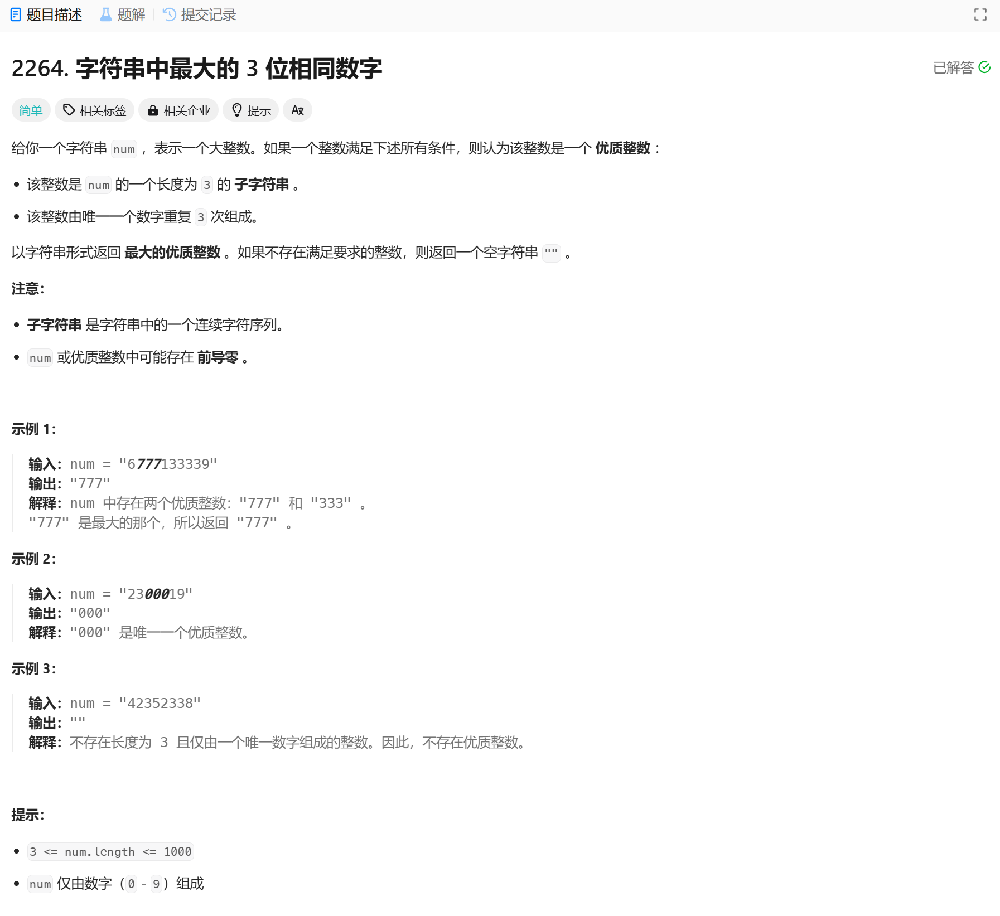

# 2264. 字符串中最大的 3 位相同数字
## 题目链接  
[2264. 字符串中最大的 3 位相同数字](https://leetcode.cn/problems/largest-3-same-digit-number-in-string/description/?envType=daily-question&envId=2025-01-08)
## 题目详情


***
## 解答一
答题者：EchoBai

### 题解
计数，然后构造加入set，最后取set最后一个返回即可。

### 代码
``` cpp
class Solution {
public:
    string largestGoodInteger(string num) {
        int len = num.length();
        if(len < 3) return std::string("");
        int cnt = 0;
        set<std::string> res;
        for(int i = 1; i < len; ++i){
            if(num[i] == num[i-1]){
                ++cnt;
                if(cnt == 2){
                    std::string str(3, num[i]);
                    res.insert(str);
                    cnt = 0;
                }
            }else{
                cnt = 0;
            }
        }
        if (!res.empty()) {
            auto it = res.rbegin(); 
            return *it;
        } 
        return std::string("");
    }
};
```
