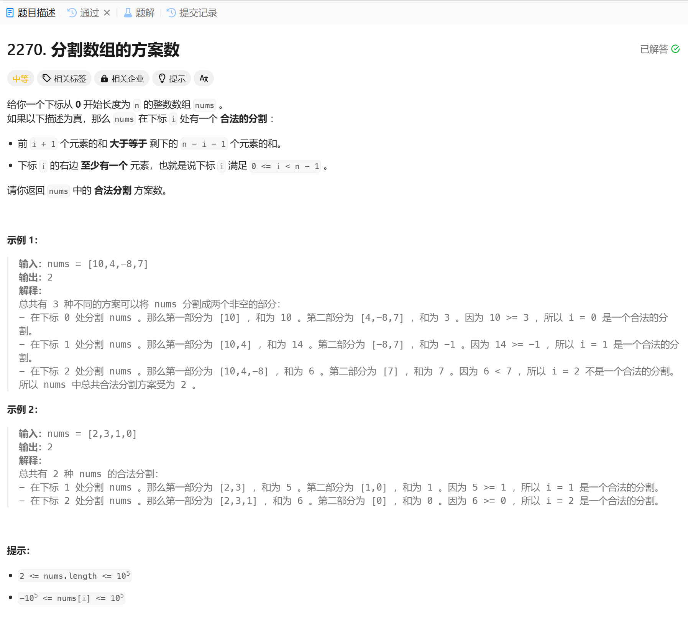

# 2270. 分割数组的方案数
## 题目链接  
[2270. 分割数组的方案数](https://leetcode.cn/problems/number-of-ways-to-split-array/?envType=daily-question&envId=2025-01-13)
## 题目详情


***
## 解答一
答题者：EchoBai

### 题解
先计算出前缀和然后判断前后和的大小即可。

### 代码
``` cpp
class Solution {
public:
    int waysToSplitArray(vector<int>& nums) {
        int size = nums.size();
        vector<long long>preSum(size, 0);
        long long sum = 0;
        for(int i = 0; i < size; ++i){
            sum += nums[i];
            preSum[i] = sum;
        }

        int cnt = 0;
        for(int i = 0; i < size - 1; ++i){
            if(preSum[i] >= sum - preSum[i]){
                ++cnt;
            }
        }
        return cnt;
    }
};
```
