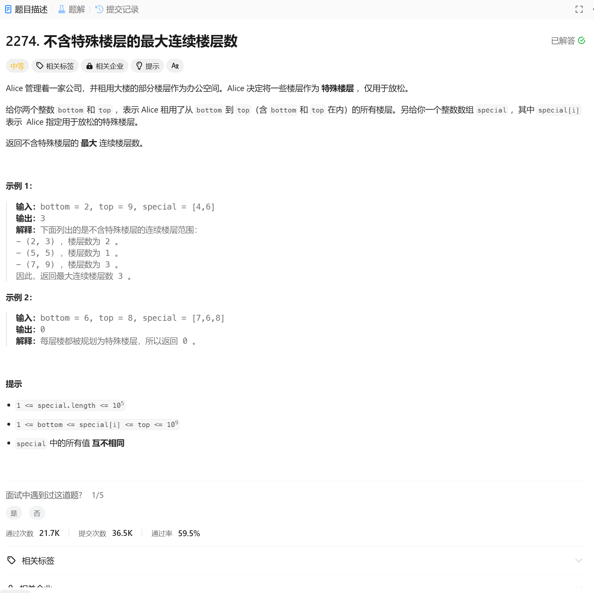

# 2274. 不含特殊楼层的最大连续楼层数
## 题目链接  
[2274. 不含特殊楼层的最大连续楼层数](https://leetcode.cn/problems/maximum-consecutive-floors-without-special-floors/description/?envType=daily-question&envId=2025-01-06)
## 题目详情


***
## 解答一
答题者：EchoBai

### 题解
排序特殊楼层数组，求出前后楼层的差，找到最大差值即可。

### 代码
``` cpp
class Solution {
public:
    int maxConsecutive(int bottom, int top, vector<int>& special) {
        int size = special.size();
        int totalSize = top - bottom + 1;
        if(size == totalSize) return 0;
        sort(special.begin(), special.end());
        int maxLen = std::max(special[0] - bottom, top - special.back());
        for(int i = 1; i < size; ++i){
            maxLen = std::max(maxLen, special[i] - special[i - 1] - 1);
        }
        
        return maxLen;
    }
};
```
