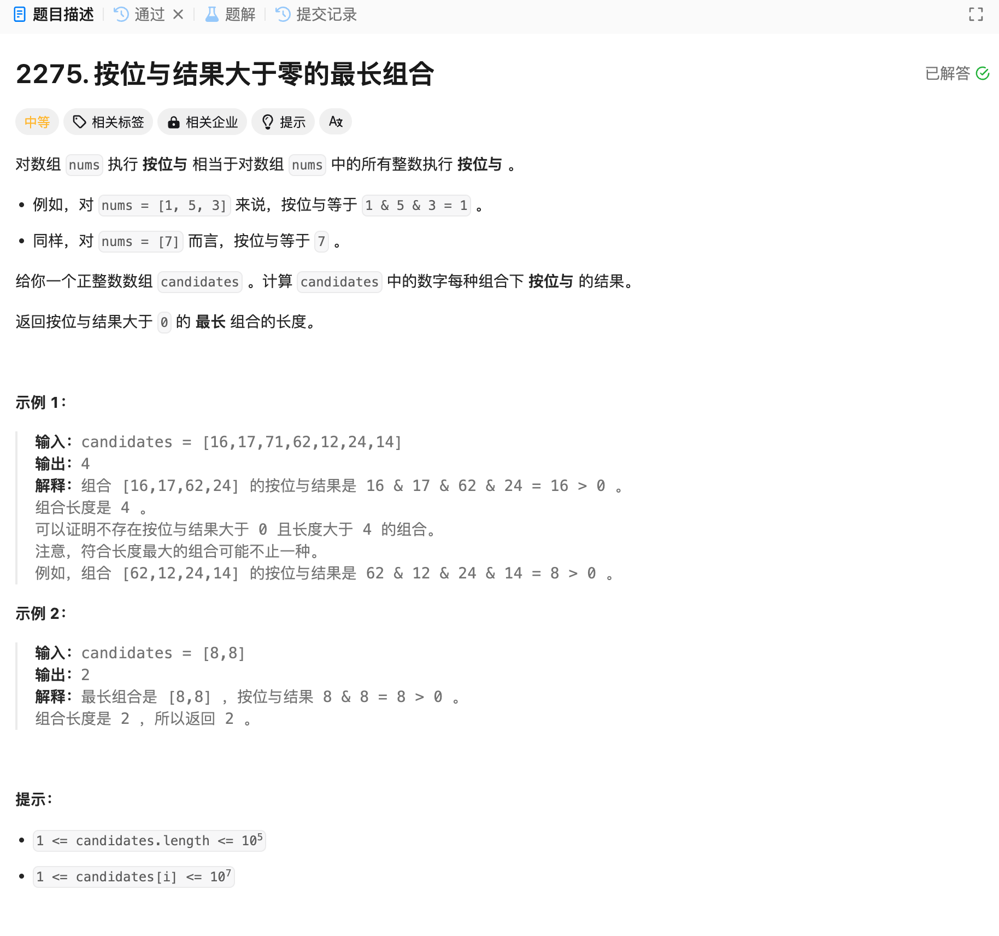

# 2275. 按位与结果大于零的最长组合
## 题目链接  
[2275. 按位与结果大于零的最长组合](https://leetcode.cn/problems/largest-combination-with-bitwise-and-greater-than-zero/description/)
## 题目详情


***
## 解答一
答题者：EchoBai

### 题解
题目给的数字最大为24位的二进制位数，因此声明一个大小为24的数组，首先将num转为二进制表示，然后统计每一位为1的个数，要保证结果大于0，则在相同位置必须为1，因此直接返回数组内1个数最大的即可。

### 代码
``` cpp
class Solution {
public:
    int largestCombination(vector<int>& candidates) {
        vector<std::string> vt;
        int bitNums[24]{};
        int res = 0;
        for(const auto& e : candidates){
            std::bitset<24> bits(e);
            for(int i = 0; i < 24; ++i){
                if(bits[i]){
                    bitNums[i]++;
                }
            }
        }
        for(int i = 0; i < 24; ++i){
            res = std::max(res, bitNums[i]);
        }
        return res;
    }
};
```
