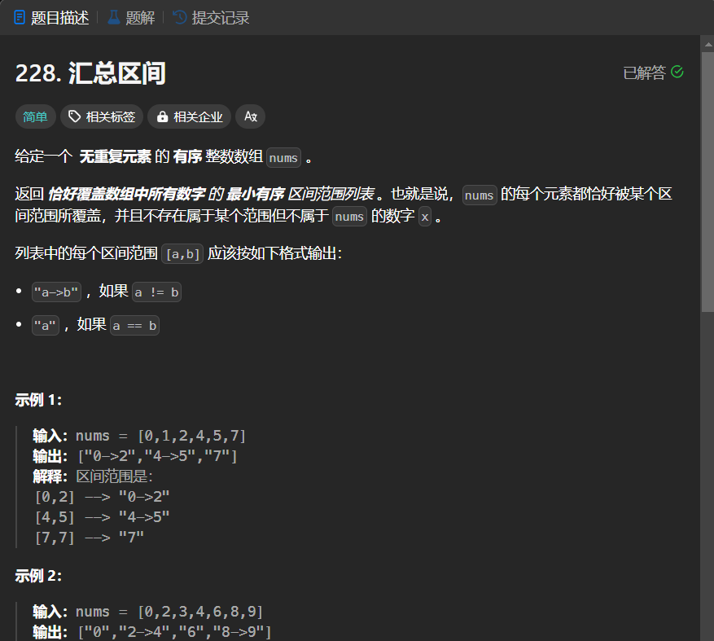

# 228. 汇总区间
## 题目链接  
[228. 汇总区间](https://leetcode.cn/problems/summary-ranges/description/?envType=study-plan-v2&envId=top-interview-150)
## 题目详情


***
## 解答一
答题者：EchoBai

### 题解
根据题意，首先空数组应返回空，因此要队特殊情况进行判断，其次对于正常情况，我们可以使用`left`和`right`两个指针作为区间端点指示,只需找出连续区间然后添加进数组中并将两个端点重新指示到新的位置即可。

### 代码
``` cpp
class Solution {
public:
    vector<string> summaryRanges(vector<int>& nums) {
        vector<string> res;
        if(nums.size() == 0)
            return res;
        int left = 0;
        int right = 0;
        for(int i = 1; i < nums.size(); ++i){
            if(nums[i-1] + 1 == nums[i]){
                ++right;
            }else{
                string tmp;
                if(left < right){
                    tmp.append(std::to_string(nums[left]));
                    tmp.append("->");
                    tmp.append(std::to_string(nums[right]));
                }else{
                    tmp.append(std::to_string(nums[right]));
                }
                res.push_back(tmp);
                ++right;
                left = right;
            }
        }
        string s;
        if(left < right){
            s.append(std::to_string(nums[left]));
            s.append("->");
            s.append(std::to_string(nums[right]));
        }else{
            s.append(std::to_string(nums[right]));
        }
        res.push_back(s);
        return res;

    }
};
```