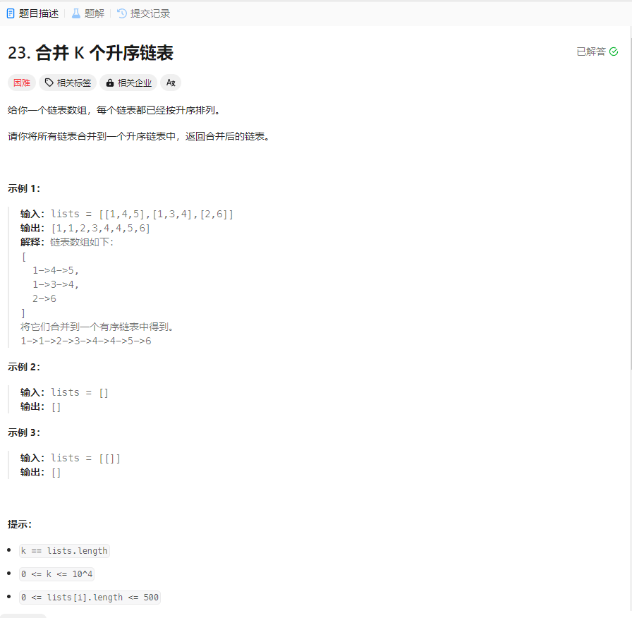

# 23. 合并 K 个升序链表
## 题目链接  
[23. 合并 K 个升序链表](https://leetcode.cn/problems/merge-k-sorted-lists/description/)
## 题目详情


## 解答一
答题者：EchoBai

### 题解
将链表的每个值放入一个`vector`排序，然后重新组合链表即可。也可以直接放入链表节点，然后根据值排序。代码分别见下。

### 代码
``` cpp
/**
 * Definition for singly-linked list.
 * struct ListNode {
 *     int val;
 *     ListNode *next;
 *     ListNode() : val(0), next(nullptr) {}
 *     ListNode(int x) : val(x), next(nullptr) {}
 *     ListNode(int x, ListNode *next) : val(x), next(next) {}
 * };
 */
class Solution {
public:
    ListNode* mergeKLists(vector<ListNode*>& lists) {
        vector<int> records;
        ListNode* res = new ListNode(-1);
        ListNode* head = res;
        int size = lists.size();
        if(size == 0) return nullptr;
        for(int i = 0; i < lists.size(); ++i){
            ListNode* p = lists[i];
            while(p){
                records.push_back(p->val);
                p = p->next;
            }
        }
        sort(records.begin(),records.end());
        for(auto e : records){
            ListNode* t = new ListNode(e);
            t->next = nullptr;
            res->next = t;
            res = res->next;
        }
        return head->next;
    }
};
```

```c++
/**
 * Definition for singly-linked list.
 * struct ListNode {
 *     int val;
 *     ListNode *next;
 *     ListNode() : val(0), next(nullptr) {}
 *     ListNode(int x) : val(x), next(nullptr) {}
 *     ListNode(int x, ListNode *next) : val(x), next(next) {}
 * };
 */
class Solution {
public:
    ListNode* mergeKLists(vector<ListNode*>& lists) {
        vector<ListNode*> records;
        ListNode* res = new ListNode(-1);
        ListNode* head = res;
        int size = lists.size();
        if(size == 0) return nullptr;
        for(int i = 0; i < lists.size(); ++i){
            ListNode* p = lists[i];
            while(p){
                records.push_back(p);
                p = p->next;
            }
        }
        sort(records.begin(),records.end(),cmp);
        for(auto e : records){
            e->next = nullptr;
            res->next = e;
            res = res->next;
        }
        return head->next;
    }
    static bool cmp(ListNode* const& a, ListNode* const& b)
    {
        return a->val < b->val;
    }
};
```


